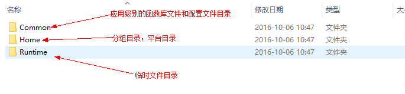
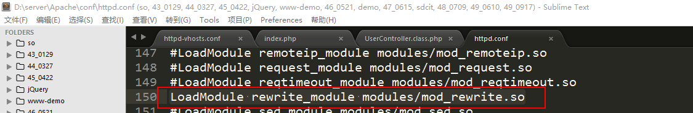
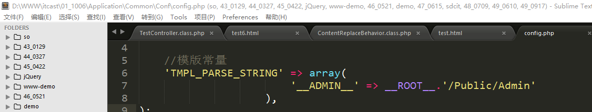

ThinkPHP（1）
==========================

一、介绍
========

1、什么是框架？
---------------

-   特征1：是一堆代码的集合；

-   特征2：一个半成品的应用；

-   特征3：包含了一些优秀的**设计模式**；

定义：框架是一堆包含了常量、方法和类等代码的集合，它是一个半成品的应用，只包含了一些项目开发的时候所使用的**底层架构**，并不包含业务逻辑，框架还包含了一些优秀设计模式，如单例模式、工厂模式、AR（Active
Record）模式等。

2、为什么要使用框架？
---------------------

在以后实际开发的时候会有一个成型的开发流程：

如果在上述的流程中不使用框架进行开发会遇到哪些问题？

-   代码风格不一样，维护困难，可能会造成项目生命周期短；

-   一处小的修改，会牵扯出很多地方的修改；

-   在后期满足客户需求方面（功能扩展）存在局限性；

3、使用框架的好处
-----------------

-   使用框架会帮助我们**简单、快捷、高效**的开发项目；

-   可以让我们有更多的时间专注于业务逻辑的开发，不需要关注**底层架构**；

-   便于处理多人协助开发中遇到的问题；

4、市面上常见的框架
-------------------

-   Zend Framework

>   是重量级框架，是php语言公司出品的官方框架，但是由于官方的考虑的功能比较全面，导致比较臃肿，启动慢。

-   YII

>   是重量级框架，是美国华人开发的框架，作者名叫薛强（英文名Qiang），中文称之为“易框架”，最大的特点就是将代码的重用性发挥到了极致。目前YII框架在外企用的还是比较多的。

-   Symfony

>   重量级框架，一款国外框架。

-   Laravel

>   轻量级框架，一款国外框架。

-   Codelgniter

>   轻量级框架，简称CI框架，代码火焰/火焰代码，一款国外框架。

-   ThinkPHP

>   是一款国人开发的框架，目前有中文的社区、中文官网、中文帮助文档等。在国内使用的还是比较普遍的。因为其有一系列中文支持，所以比较适合作为入门级框架学习。

-   ......

5、MVC
------

### 5.1、什么是MVC

MVC是一个设计模式。它是强制将用户的输入、逻辑、输出相分离，将整个项目分为三个部分：控制器（C）、模型（M）、视图（V）。

### 5.2、在编程中所经历的编程阶段

在整个编程开发的历史中，一共是经历了三个阶段：

**第一阶段：混合编程阶段**

通俗的说就是我们常说的“混编”模式。

特点：就是将php代码和html代码写在一个文件中

优点：效率高。

缺点：不易于维护，会造成一个前端人员不得不面对后端的代码，后端人员不得不面对前端代码。

**第二阶段：模版引擎阶段**

模版引擎典型的如smarty。

优点：将前端的输出和后端的逻辑代码想相分离。

缺点：效率比第一种低。

**第三阶段：MVC设计阶段**

优点：就是强制将用户的输入、逻辑、输出相分离，在维护上简单性提高了很多。

缺点：效率比前面2种模式都低。

二、ThinkPHP框架介绍
====================

1、简述
-------

ThinkPHP框架最早诞生于2006年初，最初的名字叫做FSC。于2007年元旦更名为ThinkPHP，同时其官网上线。ThinkPHP是一款国人自主开发的框架，有中文的官网，中文的论坛，中文的帮助文档，其中代码中包含了丰富的中文注释。

2、下载
-------

下载从官网下载：<http://www.thinkphp.cn>

目前最新版本的ThinkPHP是v5.0，目前使用的比较多的ThinkPHP3.2.3。点击【更多】可以查看到ThinkPHP的历史版本：

扩展（了解）：**关于软件版本的修饰词**

Alpha版本：内测版本，内部测试。

Beta版本：公测版本，面向用户，由用户去找bug。

RC版本：候选版本，软件在这个阶段就已经不会有太多的功能性调整，主要是排错。

R版本：release版本，发行版本，稳定的版本。

下载完成之后会得到一个zip压缩包：

3、文件结构
-----------

Application目录下：

ThinkPHP目录下：

Conf目录下：

**补充：**

**在ThinkPHP中除了这个convention.php配置文件之外，还有其他的配置文件，但是convention.php这个文件是系统级别的配置文件，还有一个是应用级别的配置文件，最后还有一个分组级别的配置文件。**

**从作用范围上来说：**

**系统 ＞ 应用 ＞分组**

**从优先级上说：**

**分组 ＞ 应用 ＞系统**

Library目录下：

Think目录下：

4、部署（重点）
---------------

**第一步：创建站点目录**

**第二步：配置Apache虚拟主机的配置文件，创建一个虚拟主机**

文件位于Apache目录下conf/extra/httpd-vhosts.conf

将之前的一段站点配置代码复制粘贴出一段：

**第三步：重启Apache**

**第四步：修改hosts文件，将配置文件中声明的2个域名做下绑定（解析）**

问题：hosts文件在哪？

可以通过在【运行】中输入【drivers】打开目录，然后选择etc目录。

可以在cmd中通过ping命令测试域名是否绑定成功：

**第五步：将代码文件复制到站点目录中去**

在ThinkPHP压缩包目录中复制ThinkPHP目录和index.php入口文件到站点根目录中：

复制：

通过浏览器进行访问：

Application目录（此处的Application目录和压缩包中不一样，里面还包含了三个目录）：

Home目录下：、

说明：在**首次运行**index.php入口文件的时候才会去产生对应的目录结构。再次运行不会产生变化。

5、细节问题
-----------

### 5.1、自动生成

在首次运行index.php入口文件的时候会产生相应的目录结构，目录的名字取决于在index.php中定义的常量APP_PATH。

### 5.2、目录安全文件

在自动生成的文件夹中都有一个空白的html文件，文件名叫做index.html，这个文件我们称之为目录安全文件。其作用：

在Apache的配置文件中有options
+indexes，默认展示站点目录，如果在站点目录中不存在index开头的文件，则会展示目录结构，但是有了index.html（目录安全文件）之后就不会展示结构了。

一句话概括就是**防止列出站点的文件结构**。

### 5.3、文件生成

当我们首次运行入口文件的时候发现在磁盘中系统给我们生成了一些目录，那这些目录是如何生成的？

文件夹/文件的生成主要取决于ThinkPHP的系统流程：

### 5.4、默认访问

在部署之后访问会看到一个笑脸，笑脸是怎么输出的？

**默认分组/平台：Home**

**默认控制器：Index**

**默认方法：index**

上述的默认值，可以在系统配置文件中找到：

分组也叫模块或者平台。

三、ThinkPHP中控制器
====================

1、控制器创建
-------------

命名规则：**控制名（英文首字母大写）+Controller关键词+.class.php**

例如：创建商品控制器则可以写成GoodsController.class.php，用户控制器则写成UserController.class.php。

案例：在Home分组中创建一个用户控制器User控制器。

控制器结构代码：

总结步骤：

**第一步：声明当前控制器（类）的命名空间；**

**第二步：引入父类控制器（类）；**

**第三步：声明控制器（类）并且继承父类；**

**说明：命名空间**

第一：命名空间是在php5.3版本中引入的一个概念，所以ThinkPHP3.2.3要求大于等于5.3版本的php。

第二：命名空间本身跟目录没有关系，但是在**ThinkPHP中命名的声明和使用必须跟目录挂钩**。

案例：参考上述结构代码的完善三步骤，来完善刚才创建的user控制器。

在类中编写一个测试方法，名字可以起叫test：

访问结果：

如果后期需要更多的控制器来实现功能，则只需要按照上述的创建步骤反复的创建更多需要的控制器就行。

四、路由形式（重点）
====================

路由：是指访问项目中具体某个方法的**URL**地址。

在ThinkPHP中系统提供了4种路由形式：

-   普通形式路由

-   Pathinfo形式路由

-   Rewrite形式路由

-   兼容形式路由

1、普通形式路由（get形式路由）
------------------------------

路由形式：[http://网址/](http://网址/)**入库文件?m=分组名&c=控制器名&a=方法名&参数名=参数值**

例如：访问Home分组下的User控制器中的test方法，并且传递一个参数，id=1

<http://1006.com/index.php?m=Home&c=User&a=test&id=1>

问题：URL传递的任何东西都会在URL地址栏中显示出来，既不安全也不好看。

2、pathinfo路由形式（默认）
---------------------------

路由形式：[http://网址/入口文件/分组名/控制器名/方法/参数名1/参数值1/参数名2/参数值2](http://网址/入口文件/分组名/控制器名/方法/参数名1/参数值1/参数名2/参数值2)

例如：访问Home分组下的User控制器中的test方法，并且传递一个参数，id=1

<http://1006.com/index.php/Home/User/test/id/100>

3、rewrite路由形式
------------------

路由形式：[http://网址/分组名/控制器名/方法/参数名1/参数值1/参数名2/参数值2](http://网址/分组名/控制器名/方法/参数名1/参数值1/参数名2/参数值2)

和ThinkPHP默认的路由形式相比就是只缺少了入口文件。

例如：访问Home分组下的User控制器中的test方法，并且传递一个参数，id=1

<http://1006.com/Home/User/test/id/100>

注意：该路由形式不能直接使用，需要配置完成才能使用。

配置步骤

**第一步：需要修改Apache配置文件httpd.conf，开启重写模块，去掉之前的注释符**

**第二步：需要修改虚拟主机配置文件，给需要开启重写的站点目录配置处添加allowoverride，并且值是all**

**第三步：如修改了Apache配置文件，则还需要重新启动Apache**

**第四步：将ThinkPHP压缩包中的.htaccess文件复制到入口文件的同级目录**

注意：php一共拥有好几个运行模式，每个运行模式的使用.htaccess文件的方法可能不一样。

**这种路由形式需要Apache的支持，而除了Apache软件之外服务器软件还有nginx、lightd等等，所以第三种路由形式一般情况下不推荐使用**。

4、兼容路由形式
---------------

路由形式：[http://网址/](http://网址/)入口文件?s=/分组名/控制器名/方法名/参数名1/参数值1

问题：**兼容路由形式有几个参数**？

答：上述路由形式只有1个参数，参数名是s，等于号后面的都是s参数的值

例如：访问Home分组下的User控制器中的test方法，并且传递一个参数，id=10086

<http://1006.com/index.php?s=/Home/User/test/id/10086>

5、关于ThinkPHP中路由形式的配置
-------------------------------

路由形式在ThinkPHP系统中的配置文件是有体现的，

特别说明：**路由形式的配置值，不影响我们在地址栏中直接输入其他形式路由访问。该配置项的值影响的是ThinkPHP系统封装的URL组装函数（U函数）的生成url地址的形式**。

五、分组
========

分组：一般的项目都会根据某个功能的使用对象来区分代码，这个时候放到一起之后会形成一个文件夹，这个文件夹就可以称之为分组。分组就是我们通常所指的平台（前台、后台）。

例如在刚部署好的ThinkPHP系统中Home目录就是一个分组目录。后期如果需要使用更多的分组，则需要自己去创建分组。

如何去创建分组？

步骤：**参考Home分组的目录结构，重新创建一个新的目录，在其中依照Home中的结构，创建对应的目录即可**。

**第一步：创建一个分组的目录，目录与Home目录同级**

**第二步：创建Admin目录中的文件结构**

分组创建好之后，可以在Admin分组中编写一个控制器，然后编写方法进行测试访问：

编写结构代码：

编写测试方法：

分组的URL访问路由：

[http://网址/入口文件/分组名/控制器名/](http://网址/入口文件/分组名/控制器名/)方法

当前测试方法访问地址：

<http://1006.com/index.php/Admin/Test/test>

如果需要创建多个分组，参考以上的步骤，反复创建对应的目录结构就行。

六、控制器中的跳转
==================

1、URL组装
----------

Url组装就是根据某个规则，来组成一个url地址，这个功能就叫做url组装。

在ThinkPHP中，系统提供了一个封装的函数来处理url的组装，这个方法叫做U方法。

U方法是系统提供的快速方法，除了U方法这样大写字母的方法之外，还有一些其他的快速方法如：**A、B、C、D、E、F、G、I、M、R、S**。这些方法都定义在系统的函数库文件中（functions.php）

U语法格式：

**U(‘URL路径’,参数数组);**

例如：要使用U方法组装出当前控制器下index方法地址，则可以写成

U(‘index’);

再例如：使用U方法组装出另外一个控制器Index中的index的地址，则可以写成：

U(‘Index/index’);

如果需要给指定的页面添加参数，比如给Index控制器下的index方法传递一个id=100

**U(‘Index/index’,array(‘id’ =\> 100));**

总结出一个通用的格式：

**U(‘[分组名/控制器名/]方法名’,array(‘参数名1’ =\> 参数值1,’参数名2’ =\>
参数值2));**

2、系统跳转方法
---------------

在ThinkPHP中系统有2个跳转方法，分别是成功跳转和失败跳转：

成功：

\$this -\> success(跳转提示,跳转地址,等待时间);

失败：

\$this -\> error(跳转提示,跳转地址,等待时间);

**跳转提示参数必须要有，后面的地址和时间可以没有，如果没有指定跳转地址，则跳转到上一页**。

在实际使用的时候，成功跳转会看到一个笑脸：

失败跳转会看到：

说明：**上述案例中使用success和error方法在当前的控制器中并没有定义，其是父类控制器中已经定义好的方法，由于当前控制器继承了父类，所以可以直接使用**。

七、ThinkPHP中的视图（重点）
============================

1、什么是视图
-------------

视图就是MVC三大组成部分中V（View），主要是负责信息的输出和展示。

2、视图的创建
-------------

**创建的位置需要是在分组目录下的View目录下与控制器同名的目录中。例如Test控制器中**的login方法，需要有一个模版，则该模版文件login.html需要放到View/Test/login.html

例如：创建Test控制器的test方法模版

如果有多个模版文件，则按照上面的要求进行创建。

3、视图的展示
-------------

在smarty中展示模版使用的方法是display，在ThinkPHP中同样也是display方法。Display在ThinkPHP中的语法格式：

**\$this -\> display(); 展示当前控制器下与当前请求方法名称一致的模版文件**

\$this -\> display(‘模版文件名[不带后缀]’); 展示当前控制器下的指定模版文件

\$this -\> display(‘View目录下的目录名/模版文件名[不带后缀]’);
展示指定控制器目录下的指定模版文件

案例：

在Test控制器中的test方法中展示test.html

在Test控制器中的test1方法中展示test.html

在Test控制器中的test2方法展示View/Demo/test.html

4、变量分配（初阶）
-------------------

在实际开发的时候不仅仅只是展示模版这么简单，往往还需要展示数据，这个时候变量还在控制器的方法中，需要将数据给传递到模版中并且展示，这个过程叫做变量分配。

在ThinkPHP中系统封装好了一个变量的分配方法，这个方法叫做assign。具体语法：

**\$this -\> assign(‘模版中变量名’,\$php中的变量名);**

说明：**一般情况两个参数的变量都是一样的**。

案例：在test控制器中的test方法中传递一个变量给test.html展示。

目前已经将var变量传递给了模版文件test.html，在模板文件中如何去展示数据？

在ThinkPHP中默认的展示基本变量方法如下：

**{\$模版中的变量名}**

展示效果：

5、变量分隔符
-------------

在ThinkPHP中默认的变量左右分割符是{和}，其是可以被更改的，可以在配置文件中找到具体的配置项：

6、模版常量替换机制
-------------------

在实际开发的时候会出现一个这样的问题：在引入图片、css、js文件的时候，往往需要写一些比较复杂的路径，所以这个时候我们比较希望能有一些特殊的常量将很长很复杂的路径简单化，这个时候可以考拉使用模版常量替换的机制。

在ThinkPHP中系统默认给我们提供以下几个常用的**模版常量**：

**\__MODULE__：表示从域名后面开始一直到分组名结束的路由**

**\__CONTROLLER__：表示从域名后面开始一直到控制器结束的路由**

**\__ACTION__：表示从域名后面开始一直到方法名结束的路由**

**\__PUBLIC__：站点根目录下的Public目录的路由**

**\__SELF__：表示从域名后面开始一直到路由的最后（如果没有参数，则__SELF__和__ACTION__所表达的内容是一样的）**

具体的输出：

为什么上述的几个常量就可以表示上面输出的这些路由呢？

答：在ThinkPHP中“模版常量”是通过模版内容替换机制来实现的，并非是常量的定义。替换机制可以查看行为文件ContentReplace.Behaviour.class.php

其模版常量的实现核心就是字符串的替换。

为了后期使用的方便，我们可以在配置文件中定义一个自定义的模版常量：

说明：**在开发的时候，不到万不得已不要去修改系统配置文件。可以将需要修改的配置项在分组/应用级别的配置文件中去定义**：

测试：

八、综合案例-实现OA系统的登录页面展示
=====================================

控制器：PublicController.class.php

方法：login

模版文件：login.html

**第一步：创建控制器文件，并且编写结构代码**

**第二步：编写方法login，展示模版文件login.html**

**第三步：将模版文件复制到指定的位置**

位置：./Application/Admin/View/Public/login.html

**第四步：将相应的静态资源文件复制到指定的位置**

位置：/Public/Admin

**第五步：修改模版文件login.html中的静态资源文件的引入路径**

显示效果：

九、作业
========

实现今天的综合案例。复习所讲的知识点。
