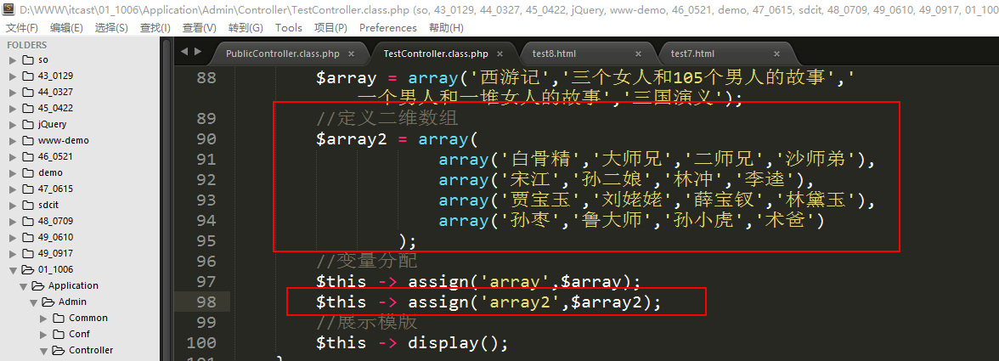
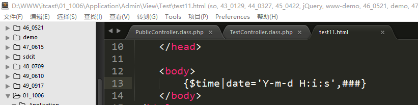
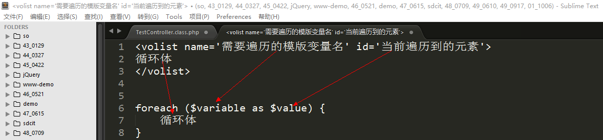

ThinkPHP（2）
=============

一、ThinkPHP中的视图（2）（重点）
=================================

1、模版内容获取方法
-------------------

在ThinkPHP中有一个方法和display方法有点点相似。这个方法叫做fetch方法：

Display方法：\$this -\> display(); 展示模版

Fetch方法：\$this -\> fetch(); 获取模版**（有返回值）**

在ThinkPHP中系统封装好了一个友好的打印方法，这个方法是dump方法：

**语法格式：dump(需要打印的变量); 封装在系统的函数库文件functions.php中**

在底层实现上差异：

Display方法：**替换模版中常量/变量 → 获取模版内容** → 输出模版内容

Fetch方法：**替换模版中常量/变量 → 获取模版内容**

Display方法的前2步的操作实际上是通过fetch方法来实现：

2、视图中的注释
---------------

视图中的注释特指是ThinkPHP中视图的注释。‘’

回顾一下html中的注释写法：**\<!—注释内容--\>**

普通的html注释会在页面的源代码中会被输出：

**在ThinkPHP中的模版注释：**

**行注释：{//行注释内容}**

**块注释：{/\*块注释内容\*/}**

显示效果：

**经典面试题**：

问：ThinkPHP中的行注释和块注释与普通的html注释有什么区别？

答：普通的html注释属于客户端注释，会在浏览器的源代码中输出；而ThinkPHP中的模版注释则属于服务器端的注释，不会被浏览器输出。

**注意点：**

**第一：行注释不要当作块注释来写（横跨多行）；**

**第二：在行注释和块注释当中（大括号里面）不要再出现大括号（模版变量）；**

3、变量分配（进阶）
-------------------

-   简单变量的输出

-   一维数组的输出

-   二维数组的输出

-   对象变量的输出

### 3.1、一维数组

在ThinkPHP中变量的分配（不考虑变量类型）都是使用assign语法格式：

\$this -\> assign(‘模版中的变量’,php中变量);

在控制器中定义一个一维数组：

在php中输出数组的具体元素可以通过下标的形式输出：**\$array[key]**。

关于数组在模版中输出的语法格式：

支持中括号形式：**{\$array[key]}**

支持点形式：**{\$array.key}**

定义模版并且输出：

两种形式在输出的效果上没有什么区别，所以在实际开发的时候，两种任意一种都可以使用。

### 3.2、二维数组

在方法中定义一个二维数组，然后将其分配到模版中：

在二维数组中：**点形式和中括号形式，同样适用**。

模版中代码：

输出效果：

### 3.3、对象变量

对象在实例化之后一般会保存到一个变量当中去，这个变量也可以被分配到模版当中去。

得创建一个对象：

存储位置位于Admin/Controller/Student.class.php

类的实例化：

需要注意：**在命名空间的语法要求中，如果不写命名空间（也不使用include、require），系统会默认先去当前空间下去寻找需要的元素，如果找不到，则报错**。

为了在后期使用中文的时候不乱码，可以在入口文件（index.php）中添加一个header声明字符集：

在方法中打印对象：

将对象变量分配到模版中去展示：

在php中如何去输出一个对象的属性？可以通过**\$obj -\> attr/\$obj ::
attr**这种形式输出对象的属性。

在ThinkPHP的模版中输出属性的值，可以通过下面的两种方式来实现：

**支持箭头形式：{\$obj -\> attr}**

**支持冒号形式：{\$obj : attr}**

**切记：在ThinkPHP模版中，在输出对象的属性的时候，千万不要使用点形式，因为ThinkPHP不允许将对象作为数组使用，会提示以下的错误**：

冒号形式和箭头形式的输出结果：

4、系统变量
-----------

在ThinkPHP中系统提供了以下几个系统级别的变量（超全局变量在模版中的使用）：

-   \$Think.server 等价于\$_SERVER，获取服务器的相关信息

-   \$Think.get 等价于\$_GET，获取get请求的信息

-   \$Think.post 等价于\$_POST，获取post请求中的信息

-   \$Think.request 等价于\$_REQUEST，获取get和post中信息

-   \$Think.cookie 等价于\$_COOKIE，获取cookie中的信息

-   \$Think.session 等价于\$_SESSION，获取session中的信息

-   \$Think.config
    获取ThinkPHP中所有配置文件的一个总和，如果后面指定了元素，则获取指定的配置

上述7个系统变量的语法都是一样的，在模版中使用的语法格式是：

**{\$Think.xxx.具体的元素下标}**

例如：需要获取get请求中的id，则可以写成{\$Think.get.id}。

案例：在模版中输出其中的部分变量信息。

在控制器中定义一个方法，输出模版：

模版中输出：

输出结果：

5、视图中使用函数（重点）
-------------------------

在实际开发的时候，有些变量在模版中不能直接使用，举个栗子：在数据表中存储的时间一般都是时间戳格式，在展示的时候需要处理格式化，需要遍历，操作相对而言比较繁琐。这个时候可以使用视图中使用函数的方式来解决这个问题。

语法格式：

**{\$变量\|函数名1\|函数名2=参数1,参数2,\#\#\#…}**

参数说明：

\$变量：模版变量

\|：变量修饰符

函数名1：表示需要使用的第一个函数

函数名2：表示需要使用的第二个函数

参数1、参数2：函数2的参数

=：其实就是表示该函数有参数，类似于php中的函数名后面的()

\#\#\#：表示变量的自身

案例1（经典）：时间戳的格式化。（100%工作中使用）

分析：**格式化时间戳使用的函数是date，语法格式是date(‘Y-m-d H:i:s’,时间戳);**

输出结果:

特别说明：

**第一：\#\#\#什么时候该写，什么不该写？当需要使用的函数只有一个参数并且参数是变量自身的时候，\#\#\#可以省略不写；当需要使用的函数有多个参数，但是其第一个参数是变量自身的时候，也可以省略不写\#\#\#；**

**第二：关于函数名的说明，函数名对应的函数必须是php内置的函数或者是在函数库文件中定义好的函数；其他的主观臆造的函数不能使用。**

案例2：定义一个字符串，**截取**其中的前5个字符，并且将其**转化成大写**。

分析：截取字符串使用函数substr，转化大写使用函数strtoupper。

实现的效果：

6、默认值
---------

使用场景：在论坛的用户个性签名处，一般会看到一句提示“这个家伙很懒，什么都没留下…”，这句话只有当用户的个性签名没有填写的时候才会显示。

默认值：就是当某个变量**不存在或者为空**的时候，就会显示默认的字符，默认的字符就是变量的默认值。

语法：

**{\$变量名\|default=默认值}
集合视图中使用函数的语法格式，可以得知default其实是ThinkPHP中封装的一个函数，默认值是函数的参数**

默认值的使用：

显示结果：

7、运算符
---------

在ThinkPHP中同样支持在模版中对变量进行运算：

-   \+ {\$a+\$b} 计算变量a加上变量b的结果

-   \- {\$a-\$b} 计算变量a减去变量b的结果

-   \* {\$a\*\$b} 计算变量a乘以变量b的结果

-   / {\$a/\$b} 计算变量a除以变量b的结果

-   % {\$a%\$b} 计算变量a除以变量b的余数

-   \++ {\$a++} 或 {++\$a} 自增运算

-   \-- {\$a--} 或 {--\$a} 自减运算

在方法中定义变量a和变量b传递给模版展示计算结果：

在模版中进行运算：

运算结果：

8、文件包含
-----------

在实际开发的时候一般情况会把网站的公共部分，如头部、尾部等部分可以单独的存放到一个文件中，在后期的时候可以直接引入该部分，在后期维护的时候只需要维护一份代码就可以；如果说首尾等公共部分不单独拿出来，会造成2个问题，一个是代码重复，再者就是在后期维护的时候很麻烦。

在ThinkPHP中系统提供了一个模版标签，可以让我们引入一些公共部分的代码文件，这个标签是include标签：

**\<include file=’需要引入的模版文件’ /\>**

说明：**路径可以是相对路径，但是相对于入口文件的。**

案例：使用include的标签语法，来实现页面的首尾引入效果。

先创建出三个模版文件（顶部、body、尾部）：

显示方法：

模版中的引入代码：

效果：

说明：在实际开发的时候，上述的路径很长还很容易写错。往往我们还会将其写成另外一种比较简单的方法：

**\<include file=’View目录名/模版文件名’ /\>**

上述的代码可以改写成：

除了使用include标签来引入文件之外，include标签还有另外一个用法：用来传递参数给引入的模版文件。

**\<include file=’需要引入的模版文件’ 参数名=’参数值’ /\>**

上述的语法格式是给引入文件传递一个参数，参数名的名字就是后面的参数名，值就是后面的值。

在目标文件中使用参数的位置写成下面的形式：

**[参数名]**

说明：如果目标文件中的参数[title]不存在，则[title]会被原样的输出到浏览器上。

9、循环遍历（重点）
-------------------

在ThinkPHP中系统提供了2个标签来实现数组在模版中的遍历：

volist标签、foreach标签。

Volist语法格式：

Foreach语法格式：

从上述的语法格式发现volist标签和foreach标签的语法结构上大体是一样的，那为什么系统还封装2个模版标签呢？

区别在于：volist除了上述的name和id属性对之外，还支持更多的属性对，如mod、key、length等等，而foreach标签除了上述的name和item之外只支持key属性对。可以理解成foreach标签是volist标签的一个简化版本。

后期在使用的时候可以根据实际情况选择性的使用**volist**标签和foreach标签。

### 9.1、一维数组遍历

在模版中遍历数组：

### 9.2、二维数组遍历

在模版中进行遍历：

遍历结果：

10、if标签
----------

If标签如果php中if语句的作用，if是用于流程控制的。

在ThinkPHP中if标签也是用于流程控制的。

If标签的语法格式：

**\<if condition=’条件表达式’\>**

**输出结果1**

**\<elseif condition=’条件表达式2’/\>**

**输出结果2**

**\<elseif condition=’条件表达式3’/\>**

**…**

**\<else/\>**

**最后一个输出**

**\</if\>**

案例：在php输出今天的星期数字，然后传递给模版，在模版中使用if标签判断今天是星期几。

在模版中编写if标签的判断代码：

显示效果：

11、php标签
-----------

Php标签就是指在模版中使用php语法格式。

模版中的php标签ThinkPHP支持2种形式：

**第一种：PHP内置的php标签；语法格式：\<?php PHP代码段?\>**

**第二种：ThinkPHP封装的php标签；语法格式：\<php\>PHP代码段\</php\>**

分别使用两种php标签：

显示效果：

在实际开发的时候一般情况不建议在模版中使用php标签，在配置项中有一个配置项可以禁用php标签，配置项叫做：**TMPL_DENY_PHP**：

禁用php标签之后，只是禁用掉原始的php标签，并不会禁用ThinkPHP封装的php标签。但是不建议禁用，原因是系统的跳转方法的模版文件使用了原生的php标签：

禁止使用原生的php标签错误提示：

二、ThinkPHP中的模型
====================

1、配置数据库连接
-----------------

数据库的连接配置项可以在系统的主配置文件中找到：

将上述的配置项复制粘贴到应用级别的配置文件中（一般一个应用使用一个数据库）：

2、数据库/表创建
----------------

数据库名：db_oa

数据表名：sp_dept （department）

在数据库【本机数据库】上右击【新建数据库】，然后填写上数据库的相关信息。点击确定完成数据库的创建。

创建数据表sp_dept

打开数据库db_oa，然后点击【查询】，再点击【新建查询】，将sql语句贴近来，然后点击【运行】

然后邮件【表】，选择【刷新】，之后就可以查看到刚才新创建的数据表

3、什么是模型
-------------

模型是MVC三大组成部分的M（Model），作用是负责与数据表的数据交互（CURD）。

4、模型的创建
-------------

命名规范：**模型名（要求是不带前缀的表名并且首字母大写）+Model关键词+.class.php**

代码结构规范：

**第一步：声明命名空间；**

**第二步：引入父类模型Model.class.php；**

**第三步：声明模型并且继承父类模型；**

例如：创建一个部门模型文件。

命名：**DeptModel.class.php**

代码规范：

问：空模型能否进行数据表的基本操作（CURD）？

答：可以，因为模型继承了父类，所以可以执行基本的操作。

5、模型的实例化操作（重点）
---------------------------

模型虽然已经创建完成，但是由于模型的本质是一个类，类在使用的时候需要实例化操作。

### 5.1、普通实例化方法

普通实例化方法是指通过自己编写代码来new一个对象。

**\$obj = new 类名();**

在控制器中定义一个方法来实例化模型，使用的是普通方式实例化：

创建部门控制器文件：

实例化代码：

实例化结果：

### 5.2、快速实例化方法

上述的普通实例化方法虽然可以进行实例化操作，但是使用上比较麻烦，还需要考虑命名空间，所以ThinkPHP为了简单、快速、高效开发，为我们提供了2个快速方法可以对模型进行实例化操作：

M方法和D方法。

D方法实例化：

**\$obj = D([‘模型名’]);**

表达的含义：实例化我们自己创建的模型（分组/Model目录中）；**如果传递了模型名，则实例化指定的模型，如果没有指定或者模型名不存在，则直接实例化父类模型（Model.class.php）**。

M方法实例化：

**\$obj = M([‘不带前缀的表名’]);**

表达的含义：直接实例化父类模型（Think目录下的Model.class.php）；**如果指定了表名，则实例化父类模型的时候关联指定的表；如果没有指定表名（没有传递参数）则不关联表，一般用于执行原生的sql语句（M()
-\> query(原生的sql语句)）。**

案例：使用快速方法D和M方法对模型进行实例化操作。

实例化代码：

经典面试题：

问：实例化方法中D方法和M方法有什么区别？

答：D方法是实例化自定义模型，如果自定义模型不存在，则实例化父类模型；M方法本身就是直接实例化父类模型。两者的差异就是实例化的对象不一样。

**在后期开发的时候怎么去选择是使用D方法还是M方法呢？**

**可以根据自身的情况，如果需要使用的操作父类中已经封装好了，则可以直接实例化父类（使用M方法），如果父类中方法不能满足我们的开发需要求，需要自己定义方法，则这个时候可以使用D方法实例化自定义模型。**

 6、CURD操作
---------------

CURD操作也就是模型操作数据表的基本操作。C（Create）、U（Update）、R（Read）、D（Delete）操作就是增删改查操作。

### 6.1、增加操作

回想一下在mysql中增加操作使用的语法格式是：insert into语句。

在ThinkPHP中系统给我们封装好了模型中的方法，可以通过方法来实现数据的增加操作，这个方法叫做add方法：

**\$model -\> add(一维数组);**

**一维数组要求必须是键值（关联）数组，键必须和数据表中字段名要匹配，如果不匹配则在增加的时候会被ThinkPHP过滤掉。**

**Add方法的返回值是新增记录的主键id。**

案例：往部门表中使用add方法添加一条记录。

返回值：

补充：如果需要添加多个记录怎么去实现呢？

方法1：可以循环使用add方法；

方法2：可以使用另外一个方法addAll，语法：\$model -\> addAll(二维数组);

**要求：最里面的那层数组也是关联数组（也要求键名字和数据表字段匹配），外层数组必须是下标从0开始的连续索引数组**

上述的addAll方法使用起来需要注意的点太多，谨慎使用。

### 6.2、修改操作

在mysql中修改操作使用的是：update table语句。

在ThinkPHP中使用的是save方法，语法格式：

**\$model -\> save(一维关联数组);**

**条件需要一维关联数组必须要有主键信息。如果没有主键信息，则相当于批量修改，在ThinkPHP中，系统为了防止误操作，不允许批量修改。**

案例：使用save方法实现部门表中财务部门的信息。

如果没有指定主键信息，则返回值是false

**返回false，表示修改操作并没有执行，而不是指mysql执行失败**。

正常执行的结果：

返回值：

表示受到影响的行数：

### 6.3、查询操作

Mysql中查询操作使用的语法是：select语句。

在ThinkPHP中系统封装了方法可以直接用于查询：select方法、find方法。

Select方法语法：

**\$model -\> select(); 表示查询全部的信息**

**\$model -\> select(id); 表示查询指定id的信息**

**\$model -\> select(‘id1,id2,id3,id4….’);
表示查询指定id集合的信息，等价于mysql中in语句**

Find方法语法：

\$model -\> find(); 表示查询当前表中的第一条记录，相当于limit 1;

**\$model -\> find(id); 表示查询表中的指定id的记录；**

返回值：

Select方法返回值是一个二维数组，即时查询的是一条记录返回也是二维数组；find返回值是一维数组。

案例：使用select方法和find方法查询部门表中的数据。

### 6.4、删除操作

在mysql中删除使用delete from语句。

在ThinkPHP中可以使用系统封装的方法delete方法：

\$model -\> delete(); //不能使用，删除方法必须要有条件，不能执行没有条件的删除

**\$model -\> delete(id); 删除指定id对应的记录**

**\$model -\> delete(‘id1,id2,id3….’); 删除多个id对应的记录**

关于删除的说明：

**删除分为两种删除：物理删除、逻辑删除。**

物理删除：是指真删除。

逻辑删除：是指假删除，本质是修改操作。在数据表中定义一个状态字段，比如说status，取值是0或者1，在查询的时候读取状态是1的；当用户点击删除之后触发修改操作，将状态从1修改成0。因为查询只查询状态是1的，所以0的就不会被显示在页面上。

案例：使用delete方法实现删除操作。

 三、作业 
=============

功能一、使用curd操作方法，实现部门的添加功能。

功能二、使用curd操作方法，实现部门的展示功能。
