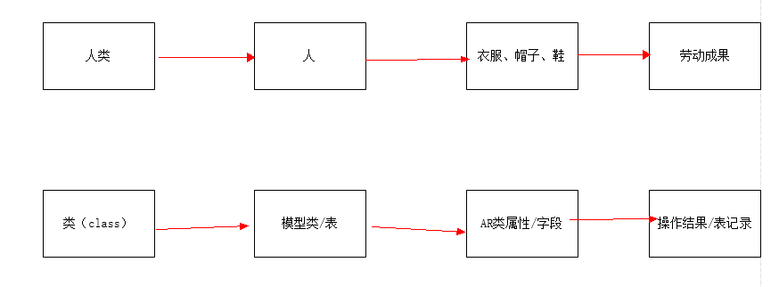
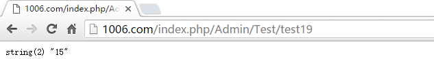
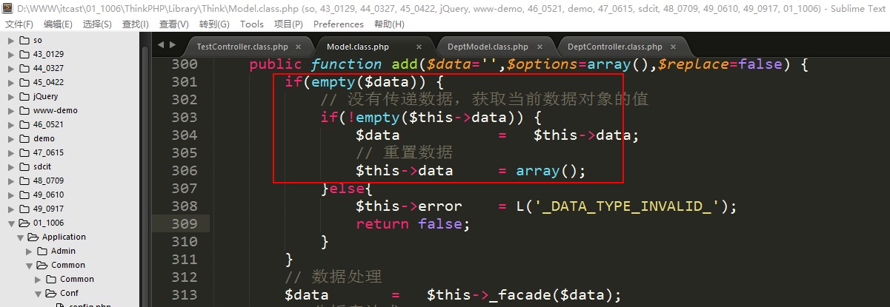
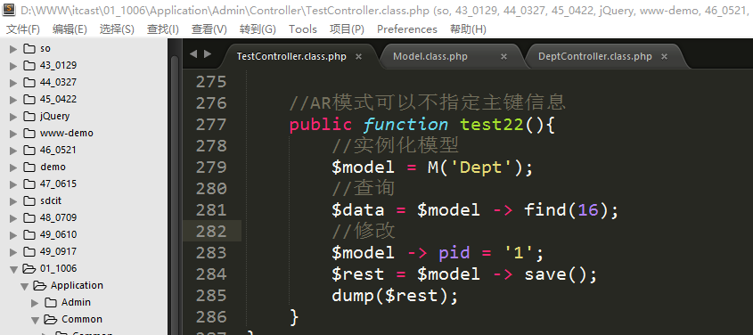
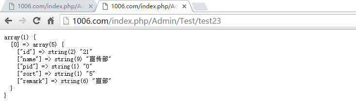

ThinkPHP（3）
==========================

一、ThinkPHP中的实用项（1）
===========================

在开发的时候我们往往会需要一些开发的错误，需要去解决错误，一般这个时候我们比较需要借助于开发工具/调试工具，比如说浏览器自带的“审核元素”，在ThinkPHP中系统为了方便我们在开发的时候对代码进行调试，也封装了一系列的调试方法：

-   跟踪信息

-   两种模式

-   Sql调试

-   性能调试

1、跟踪信息
-----------

跟踪信息：就是查询/展示系统的执行相关状况。

在ThinkPHP中跟踪信息默认是关闭的，如果需要使用，则需要开启，可以通过配置项：**SHOW_PAGE_TRACE**。

上述的配置项在主配置文件中是不存在的（在ThinkPHP中除了主配置文件中已经列出的配置项外，还存在一些零星的配置项，这些配置项在主配置文件中不存在，但是其他地方有使用），需要使用的话可以自己在配置文件中定义。

在开启跟踪信息之后，在页面的右下角会出现一个小图标：

图标的左边绿色是ThinkPHP的logo，右侧的黑块上显示的是当前请求执行所消耗的时间，单位是s（秒）。

鼠标悬浮在图标上会变成“手”的形状，说明其可以被点击，点击之后看到的效果：

在**当前模式**下，基本信息中的数据：

在文件选项卡中可以找到系统还加载了系统函数库文件functions.php和三大类配置文件：

2、两种模式
-----------

在ThinkPHP系统为了方便开发，提供了以下两种模式：**开发/调试模式、生产模式**。

调试模式：是指在开发调试阶段所使用的模式，错误信息比较详细；

生产模式：是指项目上线的时候所使用的模式，错误信息比较模糊；

在ThinkPHP中两种模式其默认值默认是生产模式，其配置项名字叫做**APP_DEBUG**。定义的位置在入口文件中：

当app_debug为false的时候表示开启生产模式，为true的时候表示开启调试模式。

调试模式下的报错信息：

生产模式下的报错信息：

在跟踪信息中体现：

生产模式：

在文件加载上存在的差异：

在生产模式下系统函数库文件functions.php、系统的配置文件、应用配置文件没有被加载，但是多了一个common\~runtime.php文件（没有被加载的配置文件的配置项都放到了新增文件中）。

**相比调试模式，生产模式下使用缓存文件common\~runtime.php，所以效率上要比调试模式高**。

问：如果在**生产模式下**去修改主配置文件/应用级别配置文件/系统函数库文件是否会生效呢？

答：不会，因为在生产模式上述的几个文件压根都没有被加载，所以修改无效。如果想让它生效，**可以把缓存文件common\~runtime.php删除掉，或者开启调试模式去修改，修改完成再换回生产模式**。

针对跟踪信息和两种模式的说明：

**因为跟踪信息和两种模式中的调试模式都会输出系统执行的相关信息，所以在项目上线的时候应该关掉跟踪信息，开启生产模式**。

3、sql调试
----------

在开发的时候，难免会遇到sql的错误，这个时候需要对sql进行调试，因为ThinkPHP在执行CURD操作的时候是让开发者写方法，并不是很直观的sql：

**\$model -\> getLastSql();**

表达的含义：**获取当前模型中最后一条成功执行的sql语句**。

案例：使用getLastSql方法获取最后一个sql语句。

打印结果：

跟踪信息中的sql：

补充说明：

上述的getLastSql方法在写的不方便，所以ThinkPHP3.2版本之后，系统增加了一个别名方法：_sql();

**\$model -\> \_sql();**

所以，上述案例代码可以写成：

4、性能调试（了解）
-------------------

在以前可能写过这么小功能，测试一段代码的执行时间。在ThinkPHP中系统提供了一个性能测试的**快速方法**，这个快速方法叫做G。

语法：

G(‘开始标记’);

需要统计效率的代码段

……

G(‘结束标记’);

G(‘开始标记’,’结束标记’,数字/字符m);

**针对G方法的第三个参数：如果参数是数字，则表示统计代码的执行时间，数字表示精确的小数位数，单位是秒；如果是字符m，则表示统计内存开销，单位是byt（需要服务器的支持）**。

案例：使用G方法来统计某段代码的执行时间开销。

显示效果：

二、AR模式
==========

1、介绍
-------

AR模式即Active Record模式，是一个对象-关系**映射**（ORM）技术。**每个AR
类代表一张数据表（或视图），数据表（或视图）的字段在 AR
类中体现为类的属性，一个AR 实例则表示表中的一行。**

AR模式的核心：三个映射/对应

**AR类 ==== 表 （模型类关联了数据表）**

**AR类的属性 ==== 表的字段**

**AR类实例 ==== 表的记录**

AR模式的语法格式：

AR模式在ThinkPHP中的典型的应用：CURD操作。

**//实例化模型**

**\$model = M(关联的表);**

**//字段映射到属性**

**\$model -\> 属性/表中字段 = 字段值;**

**\$model -\> 属性/表中字段 = 字段值;**

**…**

**//AR实例（操作）映射到表中记录**

**\$model -\> CURD操作; CURD操作没有参数**

2、AR模式的CURD操作
-------------------

在ThinkPHP中除了第二天所学习的CURD操作方法之外，还支持使用AR模式来完成：

### 2.1、增加操作

案例：使用AR模式的语法格式来实现增加操作。

执行结果：

数据库中结果：

通过数据表中的记录，可以得知，其返回值和之前add的操作返回值是一样的，都表示新增记录的主键id。

跟踪信息中的sql语句：

通过上述的代码，可能会有以下两个疑问：

**问题1：难道父类模型中真的有name、pid、sort、remark属性么？**

**答：通过观察父类模型的底层实现，我们找到了一个特殊的魔术方法__set，可以参考php手册：**

赋值成功之后可以打印模型查看到模型中存在属性data：

**问题2：为什么add方法没有参数也能执行添加操作？**

答：通过问题1中的解答，我们可以得知如果使用ar模式的话，data属性是有值，然后通过查看add方法的底层实现：

其中判断是否给add方法传递参数，如果没有传递，则使用父类模型中data属性中值，而data属性中的值恰恰就是问题1中的数据。

### 2.2、修改操作

案例：使用AR模式实现针对部门数据表记录修改。

需要注意：**不管是直接通过save方法传递数组，还是使用AR模式，修改时候的主键id必须需要**。

执行结果：

返回值和之前的save传递数组一样，表示受到影响的行数。

跟踪信息中的sql语句：

**之所以save方法可以像add方法一样不传递参数是因为，其也有跟add方法中的if判断的代码**。

### 2.3、查询操作

在ThinkPHP中，AR模式没有查询操作。这里的查询操作还是使用之前的select和find方法。

### 2.4、删除操作

需要注意：删除的时候必须需要指定主键信息

案例：使用AR模式删除表中的数据。

返回结果：

跟踪信息中的sql语句：

### 2.5、补充说明

在AR模式中U、D操作必须需要指定主键信息，但是有一种情况下可以不指定主键也能执行U、D操作：**在之前有做过查询语句，则后面如果没有指定主键，会操作当前查询到的记录**。

跟踪信息中的sql：

删除：

跟踪信息中的sql：

 三、ThinkPHP中的辅助方法（重点）
====================================

在原生的sql语句中除了我们目前所使用的基本的操作之后，还有类似于group、where、order、limit等等这样的子句。在后期如果需要用到上述的一些子句方法，以目前的知识储备肯定是不行的，所以ThinkPHP封装了相应的子句方法：

-   **where 表示限制查询的条件**

-   **limit 表示限制输出的条数**

-   **field 表示限制输出的字段 也就是select id,name,pid这样的语句**

-   **order 表示按照指定的字段进行指定的排序**

-   **group 表示按照指定的字段进行分组查询**

1、where方法
------------

作用：限制查询的条件。

在原生的sql语句中：**select 字段 from 表 where 条件**;

在ThinkPHP中系统封装了一个where方法来实现在原生的sql语句中where效果。

语法：

**\$model -\> where(条件表达式);
//在ThinkPHP中条件表达式支持字符串形式也支持数组形式，推荐使用字符串形式。**

**\$model -\> CURD操作;**

案例：使用where方法查询部门表中部门id大于20的数据。

**使用原生的sql：select \* from sp_dept where id \> 20;**

显示结果

跟踪信息中的sql：

回忆：在mysql中除了where子句之外，还有一个语法格式也能限制查询条件，这个语法是having语法。

**问题：where子句和having子句有什么区别？**

答：两个语句都表示限制查询条件，但是意义上有差异，**where表示限制查询条件，但是要求条件中的字段必须是数据表中存在的字段；而having要求条件中的字段必须是结果集中存在的**。

2、limit方法
------------

作用：限制输出的条数。（典型的应用：数据分页）

在原生的sql语句中：**select 字段 from 表 where 条件 limit 限制的条数;**

在ThinkPHP中系统提供了limit方法来实现原生的sql语句中限制条数的效果：

**第一种：\$model -\> limit(n); //n表示大于0的数字，表示输出表中的前n行**

**第二种：\$model -\> limit(起始位置,偏移量/长度);
//表示从第起始位置开始，往后查询指定长度的记录数，在实际使用的时候该种方法还支持写成\$model
-\> limit(‘起始位置,偏移量’);**

案例：使用limit语法格式来实现查询表中的数据限制。

原生sql语句：

后期使用的分页效果，其实就是使用的limit的第二种语法格式。

3、field方法
------------

作用：限制输出的结果集字段。

语法：

**\$model -\> field(‘字段1,字段2,字段3,字段4[ as 别名]….’);
//参数也就是select之后到from之前的那一串字符串。**

案例：使用field方法来查询部门表中的数据，只要显示id和name就可以。

**原生的sql：select id,name from sp_dept;**

跟踪信息中的sql语句：

显示结果：

说明：**上述三个方法在父类模型中都是真实存在的**。

4、order方法
------------

作用：指按照**指定的字段**进行**指定规则**的排序。

在原生的sql语法中使用是：order by 字段 排序规则（升序asc/降序desc）。

语法：

**\$model -\> order(‘字段名 排序规则’);**

案例：使用order方法查询部门表中的数据，并且按照id进行降序排列。

原生的sql：**select \* from sp_dept order by id desc;**

显示的跟踪信息：

5、group方法
------------

作用：分组查询。

在ThinkPHP中group分组可以使用group方法来实现：

**\$model -\> group(‘字段名’);**

案例：使用group的方法去查询部门表，要求查询出部门名称和出现的次数。

原生的sql：**select name,count(\*) as count from sp_dept group by name;**

使用辅助方法实现上述的sql：

因为上述的原生sql使用了限制字段和分组查询，所以在ThinkPHP中光靠group方法没有办法实现案例要求，还需要配合filed方法来实现：

显示的效果：

跟踪信息中的sql语句：

说明：上面2个方法（order、group）在父类模型中是不存在的，其在使用的时候是通过**魔术方法__call**来实现后续的处理的。

四、连贯操作（重点）
====================

连贯操作：所谓连贯操作就是**将辅助方法全部写在一行上的写法**，这样的形式叫做连贯操作。

也就是如下的形式：

**\$model -\> where() -\> limit() -\> order -\> field() -\> select();**

**注意点：辅助方法的顺序，在连贯操作中没有要求，只要符合模型在最前面，CURD方法在最后面即可。**

案例：将上述第5个辅助方法的案例代码用连贯操作的形式改写。

**解疑：连贯操作上的辅助方法啊为什么可以写在一行上呢？**

答：原因就是每一个辅助方法最后的返回值都是\$this，而\$this是指当前的模型类，由模型类去调用后续的辅助方法，这个是可以行得通的。这也是为什么要求CURD方法必须放在最后的原因。

**在以后的开发过程中，不管是自己写的代码还是别人写的代码，都会遵循使用连贯操作的形式来替代每一个辅助方法单独一行的写法**。

五、ThinkPHP中的统计查询
========================

在ThinkPHP中系统提供以下几个查询方法的使用，方便于在后期需要做统计的使用。

-   count() 表示查询表中总的记录数

-   max() 表示查询某个字段的最大值

-   min() 表示查询某个字段的最小值

-   avg() 表示查询某个字段的平均值

-   sum() 表示求出某个字段的总和

1、count方法
------------

**语法：\$model -\> [where() -\>] count();**

案例：查询出部门表中的总的记录数。

结果：

返回值是字符形式。

跟踪信息中的sql语句：

2、max方法
----------

语法：

**\$model -\> max(‘字段名’);**

案例：查询部门表中id最大的部门的id。

在以后实际开发的时候有一个应用：**通过max方法查询最后注册的会员id**。

返回值是字符形式。

跟踪信息中的sql：

3、min方法
----------

**语法：\$model -\> min(‘字段名’);**

案例：使用min方法查询部门表中id最小的id信息。

在以后的使用也有一个典型的应用：**查询最早注册的会员id**。

返回值也是字符形式。

跟踪信息的sql：

4、avg方法
----------

**语法：\$model -\> avg(‘字段名’);**

案例：求出部门表中id的平均值。

结果：

跟踪信息中的sql：

5、sum方法
----------

**语法：\$model -\> sum(‘字段名’);**

案例：查询字段id的总和

值是字符形式。

跟踪信息的sql：

六、扩展（1）
=============

1、fetchSql
-----------

前面我们介绍了sql调试的一个方法getLastSql或者别名_sql()，但是这个方法要求最后一条**成功执行的**sql，所以如果拿这个方法来调试sql，只能是调试逻辑错误，并不能拿来调试语法错误，所以这里给大家介绍一个新的sql调试方法：fetchSql()。

语法：

**\$model -\> where() -\> limit() … -\> order() -\> fetchSql(true) -\>
CURD操作;**

**FetchSql方法使用的时候可以完全看作是一个辅助方法，所以要求必须在model之后，在CURD操作之前，顺序无所谓。FetchSql方法只能在ThinkPHP3.2.3版本之后使用**。

在控制器中去测试：

返回值：

跟踪信息：

说明：**通过跟踪信息和返回值，我们可以发现，使用fetchSql之后原有的连贯操作没有被执行（在跟踪信息中没有sql显示），而是直接将连贯操作的语法组成的sql语句给返回**。

 七、综合案例
================

1、后台首页
-----------

控制器：IndexController.class.php

方法：index home

模版：index.html home.html

**第一步：创建控制器文件IndexController.class.php**

结构代码：

**第二步：在控制器文件中增加2个方法（index、home），作用是展示两个模版文件**

**第三步：将模版文件index.html、home.html复制到指定的位置**

位置：./Application/Admin/View/Index/\*

**第四步：修改两个模版文件中静态资源文件的引入路径**

**第五步：纠正home页面的引入路径**

原因是Index控制器和index方法是默认的控制器和默认的方法，可以省略不写，但是有pathinfo路由形式它的相对路径会受到“/”影响，所以不写默认的控制器和方法的时候会影响到相对路径。

另外一种方式：

在模版中也可以使用U方法来指定URL地址。

**U方法在模版中使用方法，需要注意，需要在其外面加上{:xxxxx}**

2、部门管理（1）
----------------

### 2.1、设计二级导航

**第一步：先复制【导航信息管理】中的二级菜单的代码，将其粘贴到【组织结构】中的指定位置**

**第二步：修改二级导航的数目，以及跳转地址**

### 2.2、实现部门的添加功能

控制器：DeptController.class.php【已经存在】

方法：add

模版：add.html

**第一步：创建add方法，展示模版**

**第二步：复制模版文件add.html到指定的位置**

位置：./Application/Admin/View/Dept/add.html

**第三步：修改模版文件中静态资源文件的引入路径**

**第四步：检查表单**

表单中大部分地方都没有问题，只有一个地方，就是提交按钮和清空按钮，它是a标签，但是修改成input之后，样式会消失，所以我们可以通过jQuery的方法来保证样式和表单的提交。

编写jQuery代码：

**第四步：展示【上级部门】信息**

展示在模版中：

分析：因为select的返回结果是二维数组，所以需要遍历操作。

**第五步：处理表单信息的提交操作**

改写add方法，判断是否是post请求，如果是，则处理表单的提交，如果不是则展示模版。

扩展：如果判断请求是否是post？

答：要是在以前，我们可以使用if(\$_POST)来判断，但是在ThinkPHP中系统为我们封装了几个比较使用的常量，可以直接用常量来判断，常量常见的如下：

**IS_POST 如果请求是post，则IS_POST的值是true，否则是false**

**IS_GET**

**IS_AJAX 如果请求是ajax，则IS_AJAX的值是true，否则是false**

IS_CGI

IS_PUT

…

关于数据接收的说明：

在之前我们使用的时候\$_POST来接收数据，在ThinkPHP中，我们可以使用I方法（快速方法）来接收数据，I方法可以接收任何类型的输入（post、get、request、put等等），并且系统默认自带防sql注入的方法（使用php内置的函数htmlspecialchars）。

语法：

**变量类型就是类似get、post等等。**

**变量名就是指\$_GET或者\$_POST中具体元素下标。**

**默认值：是当使用过滤方法之后原先的内容如果变成了空字符串，则会使用默认值来代替。**

**过滤方法：是对ThinkPHP默认提供的htmlspecialchars的补充，函数名可以是php内置的，也可以是函数库中的。**

**额外的说明：如果想接收整个数组则呢么呢？**

**如果想接收全部数据，则可以不写变量名，可以写成I(‘get.’);**

