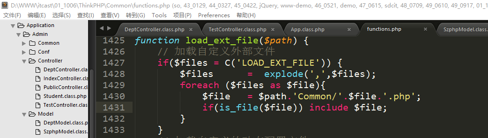
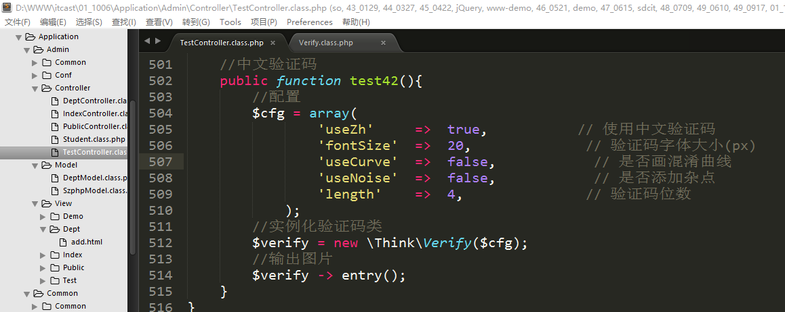
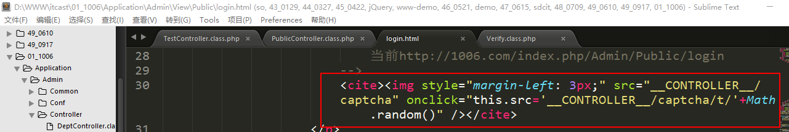
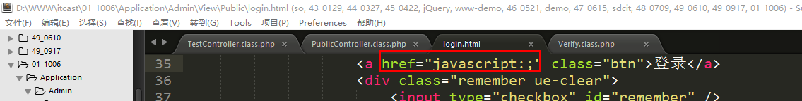
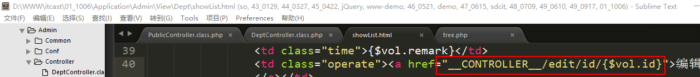

PHP高手之路之ThinkPHP（4）
==========================

一、ThinkPHP中的模型
====================

1、数据对象创建
---------------

数据对象也就是父类模型中的\$this -\>
data，上一天我们在使用AR模式的使用到了数据对象，在模型实例化的时候数据对象还是一个空数组，在后来使用了魔术方法__set来设置了数据对象的值。

从上述的一个流程中我们可以得出：既然data属性之前是空数组，后期使用的时候需要先给其赋值，也就说明，**在使用数据对象的时候必须先创建数据对象**。而__set是设置数据对象的一种方法；但是这种方式在使用的时候并不方便，原因是设置一个属性就得写一行代码；因此在ThinkPHP中系统还提供另外一种批量设置数据对象的方法：create方法。

语法：

**\$model -\> create();**

通过它的实现代码，可以发现如果不给create方法传递参数，则其默认使用post中的数据。

在结尾的两行代码中，其做了2个操作：

**第一：将处理完成的data数据赋值给了data属性，这步就是创建数据对象。**

**第二：将处理完成的数据返回出去。**

案例：改写之前编写的部门信息入库的一个代码，使用数据对象的创建方式。

**说明：如果表单中字段和数据表中字段不匹配，则在创建数据对象的时候会被过滤掉。**

关于是否接收数据对象创建方法返回值说明：

**如果想使用打印方法去查看数据是否正确则可以接收返回值，如果不想打印，则可以不接收，则在使用CURD操作的时候也不需要给具体的操作方法传递参数。如果在使用自动验证的时候，则必须要接收返回值**。

2、自动验证
-----------

自动验证就是在提交数据的时候系统会按照指定的**规则**进行数据的有效性、合理性的验证。

上述提及到规则，系统默认是没有，如果需要使用自动验证，规则需要我们自己去定义。

在前端中javascript的验证叫前端验证，在ThinkPHP中也存在验证机制，这样的验证称之叫做后端验证。

自动验证语法：没有语法，由数据对象创建方法create方法去实现自动验证，那**我们需要写的就是验证规则**。

**因为在create方法中执行了自动验证的处理，如果需使用自动验证，则必须要用数据对象创建方法进行接收数据**。

那如何去定义所谓“规则”呢？

在父类模型中存在一个成员属性，叫做_validate，这个属性是保存验证规则的。由于不能在父类模型中直接更改属性，**所以可以把这个属性复制到子类（自定义模型）中去定义规则**。

规则编写（参考手册）：

**必选参数：**

**验证字段：表单中每一个表单项的name值；**

**验证规则：就是针对验证字段的要求格式的限制，常见规则有require 字段必须、email
邮箱、url URL地址、currency 货币、number 数字。**

**错误提示：在验证不合理的时候给用户提示信息。**

可选参数：

验证条件：0表示字段存在就验证（默认），1表示必须验证，2表示字段不为空的时候验证。

附加规则：结合验证规则，两者配合起来使用。具体支持的方法，可以参考手册“自动验证”。

验证时间：1表示新增数据的时候验证，2表示编辑的时候验证，3表示全部情况下都验证（默认）。

案例：针对部门添加功能，使用自动验证来验证字段的合法性。

说明：如果在自动验证中使用函数（function）来验证字段的合法性，则第二个参数要求是函数名（函数名要是函数是php内置的函数或者自己定义的函数《自定义函数可以是函数库中声明的也可以在当前模型中去定义》）。

**注意：因为规则是定义在自定义模型中，所以模型在实例化的时候必须需要实例化自定义模型**。

自动验证失败，则create方法返回false，如果验证成功，则返回正常的数组。

输出用户提示信息：

**\$model -\> getError();**

改写代码：

批量验证：

需要配置一个成员属性：patchValidate设置成true，则表示开启批量验证。

错误信息输出：

这个时候批量验证的返回的错误信息是一个数组格式。

3、字段映射
-----------

映射就是表示一个对应关系。

应用场景：在目前表单中的name值都和数据表中的字段名都是一样的，有一些人可能通过当前功能和表单的name值猜测出数据表的名字和表结构。后期就可能会找到系统的漏洞对系统的进行功能。系统的安全性存在威胁。

因此，我们可以使用一个障眼法，将name值来随机指定，name值就和表的字段不一致，那样别人就猜测不出表的结构。

因为如果字段和数据表中的字段不匹配，在操作的时候会被系统过滤，所以需要有一个对照列表，告知系统，不对应的name值是数据表中的字段。

字段映射和自动验证一样，没有语法，只有规则定义：

**成员属性：\$_map = array();**

因为成员属性是父类模型中的，所以不能在父类模型中直接修改，需要在自定义模型中定义：

因为数据对象中使用了字段映射的检查，所以，此处如果需要使用字段映射，则必须要使用数据对象的创建方法接收数据：

通过修改前端表单中的name值进行测试：

测试结果：

在使用字段映射之后，被映射的字段后被放到数组的最后，按照字段映射的先后顺序进行排列。

4、特殊表的实例化操作
---------------------

在实际开发的时候可能会遇到有特殊表的情况，可能表会没有前缀、表的前缀不是在配置文件中定义的前缀。

模拟出一张特殊表：

表名：szphp

创建模型文件：

命名：SzphpModel.class.php

结构代码：

Szphp类的实例化操作：

实例化结果：

分析原因：**是因为在实例化的时候系统会默认给我们添加上之前在配置文件中定义的表前缀，这个时候表名就变成了sp_szphp**。

解决办法：

可以通过父类属性中的成员属性trueTableName属性，进行表名的指定，告知模型表名真实名字是什么，让其不要再关联上前缀：

实例化模型：

二、ThinkPHP中的实用项（2）
===========================

1、会话控制
-----------

会话支持一般都是指的是cookie和session。在php核心中有说及php对于cookie和session支持，在ThinkPHP中系统为了方便开发的使用，也封装了相应cookie和session方法。

### 1.1、session的支持

在ThinkPHP中系统封装了一个方法用来实现对于session的操作：session方法（定义在系统函数库文件中functions.php）。

-   **session(‘name’,’value’) 创建一个名为name的session值，值是value**

-   **\$value = session(‘name’) 读取session中的name元素值，值赋给value**

-   **session(‘name’,null) 删除名为name元素的值**

-   **session(null) 删除全部的session元素**

-   **session() 读取全部的session信息**

-   **session(‘?name’)
    判断名为name的session元素是否存在，如果存在则返回true，如果不存在，则返回false。**

案例：在方法中使用session方法session进行操作。

输出结果：

### 1.2、cookie支持

-   **cookie(‘name’,’value’) 设置一个名为name的cookie值，值是value**

-   **cookie(‘name’,’value’,3600)
    设置一个名为name的cookie值，值是value，有效期是3600s**

-   **\$value = cookie(‘name’) 读取名为name的cookie赋值给value**

-   **cookie(‘name’,null) 删除名为name的cookie值**

-   **cookie(null) 删除全部的cookie（有问题）**

-   **cookie() 获取全部的cookie**

案例：通过cookie方法对cookie进行操作。

**注意：在上述的几个方法使用中，cookie(null)这个方法有bug，虽然手册上写了说可以删除，但是在实际使用的时候并不能达到想要的效果。如果想这个操作可以实现则需要更改底层的实现代码**：

在上述代码中修改1377行和1379行，在if条件后增加一个或运算。

2、文件加载
-----------

文件加载在ThinkPHP中系统提供三个方式：

### 2.1、函数库形式加载（重点）

函数库在ThinkPHP中有三大类：系统函数库文件（functions.php）、应用级别函数库文件、分组级别函数文件。

**上述三大类的文件只有系统函数库文件默认是存在的，其他两类默认不存在，需要自行创建；**

**上述三大类文件只有系统函数库文件名叫做functions.php，另外两大类文件名叫做function.php**。

案例：使用函数库文件的形式定义需要的函数，函数名gbk2utf8

定义好的函数库文件中的函数，在使用的时候遵循php内置函数语法的要求，只要直接写上函数名(参数)，这种形式就可以了。

通过浏览器访问：

说明：

**第一：不需要引入function.php，系统在执行的时候自动帮我们引入了文件function.php文件；**

**第二：如果函数定义在应用级别的函数库文件中，则能在全部的分组（整个应用）使用；如果函数定义在某个分组的函数库文件中，则只能在当前的分组中使用，否则会报函数未定义。**

### 2.2、通过配置项动态加载

在系统的执行流程中有 一个文件会被执行到App.class.php

在该方法中执行了一个load_ext_file函数。

该方法是在系统函数库文件中定义的：

**扩展：C方法**

C方法也是快速方法之一，其作用是操作ThinkPHP中的配置项：

**C(name,value); 设置配置项name的值，值是value**

**C(name); 读取配置项name的值**

**C(); 读取全部的配置项**

**通过代码的阅读，可以发现配置项LOAD_EXT_FILE的配置格式应该是类似于下面这种形式：**

**LOAD_EXT_FILE =\> ‘abc,cde,efg…’**

**而且上述的文件应该是位于应用级别的函数库目录中。**

配置项：

在应用级别的配置文件中定义配置项LOAD_EXT_FILE，引入文件info.php

在应用函数库文件目录中定义一个info.php

实现结果：

**上述需要注意的是，同样文件在系统封装的方法中已经进行了引入，所以在使用具体的函数的时候不需要再对文件进行单独的引入，只需要像使用函数库文件的形式直接编写需要使用的函数名即传递相应的参数即可**。

### 2.3、通过load方法加载

**语法：**

**load(‘\@/不带后缀的php文件名’);**

**需要注意的是，文件必须存在于分组级别的函数库目录中，并且只能用于定义的分组中。**

案例：通过自己在分组目录中创建文件hello.php，然后在其中定义一个函数，然后再去使用load方法加载并且使用其中的函数。

编写函数：

在控制器中使用load方法加载hello.php文件：

说明：上述三个文件的加载方式在实际开发的时候都可以使用，但是一般以第一种为主（通过函数库形式自动加载）。其他的仅供参考。

三、ThinkPHP中功能类-验证码类
=============================

验证码：captcha（全自动识别机器与人类的图灵测试）。常见验证码可以分为三种：**页面上的图片形式、短信验证码、语音验证码**。

在ThinkPHP中，为了提高开发效率，系统封装了一个验证码类：Verify.class.php

1、介绍
-------

方法：

构造方法：在实例化的时候可以传递一个数组，用于和其成员属性config进行合并，生成新的配置

Check方法：校验验证码，传递参数，用户输入的验证码

Entry方法：输出图片，保存验证码到session中

 2、生成常规验证码
---------------------

常规验证码是指有数字+大小写字母组成的验证码。

步骤：

第一步：实例化验证码类；

第二步：输出图片；

结果：

3、生成中文验证码
-----------------

需要字体文件，字体文件可以在自己的计算机中找到：

打开【控制面板】-切换到【大图标】，找到【字体】-搜索‘黑体’-复制【黑体常规】

复制到zhttfs目录中

使用中文验证码的代码：

生产效果：

4、补充说明
-----------

*关于中文验证码的几点说明：*

*第一：以后在实际开发的时候不到万不得已不要使用中文验证码；*

*第二：中文验证码需要中文字体的支持，中文字体可以在自己计算机中找到，当也可以去字体网站下载（比如说站长之家chinaz.com）；*

*第三：使用中文验证码必须开启php的扩展mbstring。*

扩展开启：打开php.ini文件，去掉扩展前的分号，保存，重启Apache：

建议开启。

 四、综合案例
================

1、实现后台登录功能
-------------------

控制器：PublicController.class.php

模版：login.html

方法：login captcha checkLogin

**第一步：在控制器中创建captcha方法，用于输出验证码**

**第二步：在模版文件login.html中输出验证码**

给图片绑定点击事件，让点击图片能够刷新验证码：

**第三步：准备创建用户表**

表名：sp_user

创建成功：

**第四步：检查表单**

添加form标签：

字段完善：

修改登录按钮的href属性，阻止其默认的浏览器行为：

**第五步：编写jQuery代码实现表单的提交**

**第六步：编写checkLogin方法用于处理用户登录**

问题：对于接收到数据（密码、用户名、验证码），先验证谁？

答：先验证验证码，如果验证码正确，再去验证用户名和密码。

实现代码：

**第七步：细节完善**

修改登录之后的显示用户名：

修改退出按钮的跳转地址，并且实现退出方法：

修改跳转地址，让地址跳转到Public/logout：

需要修改文件index.js

将上述的地址修改成：

在ThinkPHP中，不能在javascript文件、css文件等非模版文件中使用任何模版引擎的东西。

2、完善部门管理功能
-------------------

### 2.1、完成部门列表展示

控制器：DeptController.class.php

方法：showList（不要使用list方法，list是关键词）

模版文件：showList.html

**第一步：创建方法showList，用户展示模版**

**第二步：将模版文件showList.html复制到指定的位置**

位置：./Application/Admin/View/Dept/showList.html

**第三步：修改模版文件中的静态资源文件的引入路径**

**第四步：修改showList方法获取部门的数据**

上述代码中本来需要使用联表操作才能实现展示上级部门名称的效果，但是可以通过二次查询的方式查询出所属上级的部门名称。

新的要求：**要求使用文件载入的知识点实现部门列表的无限级分类效果。**

将tree.php文件复制到当前分组目录下：

在方法中使用load方法载入文件tree.php

为了用户体验，我们可以将非顶级部门的前面来一个缩进效果：

显示结果：

### 2.2、完成部门编辑功能

控制器：DeptController.class.php

方法：edit（展示模版&处理提交）

模版：edit.html

**第一步：编写edit方法实现模版展示**

**第二步：修改showList.html页面，增加一个【修改】按钮**

**第三步：将模版文件edit.html复制到指定的位置**

位置：./Application/Admin/View/Dept/edit.html

**第四步：修改静态文件的引入路径**

**第五步：修改edit方法，展示出原有的数据**

说明：**需要注意，如果if标签中是进行两个变量的比较，如果变量是数组并且用的是数组的点形式，则需要在运算符“==”前后加上空格，并且在最后的一个变量后面加上空格**。

**第六步：实现数据的保存**

处理表单页面：

隐藏域：**因为系统限制不能执行批量修改，所以修改的时候必须指定主键，这也就是指定要求添加一个隐藏域，来传递id**。

jQuery代码提交：

数据保存：

### 2.3、完成部门删除功能
