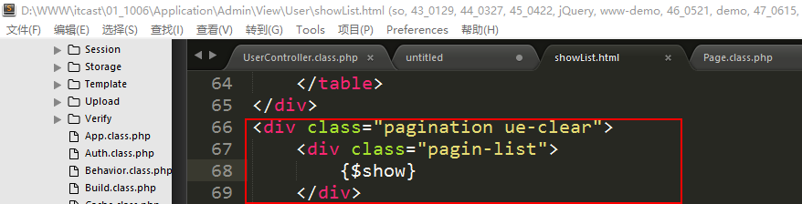

ThinkPHP（5）
==========================

一、综合案例-完善部门管理
=========================

1、实现部门的删除功能
---------------------

控制器：DeptController.class.php

方法：del

**说明：删除有单个删除，也有批量删除；所以需要给列表页添加每一行的复选框**。

**第一步：先在列表上给每一行添加一个复选框**

**第二步：要求点击【删除】按钮就可以实现删除**

点击删除获取到当前页面复选框中的值（jQuery实现），然后带着值跳转到删除方法del进行删除：

**第三步：编写del方法，实现删除**

二、综合案例-实现职员管理
=========================

1、准备工作
-----------

### 1.1、创建左侧菜单

将导航信息管理菜单设置成职员管理菜单：

### 1.2、创建控制器

控制器名：User

### 1.3、重新准备数据表

将db_oa中的数据清除，重新导入数据：

之所以是这样做，原因是之前对部门表进行了删除，导致职员表中的部门id在部门表中不存在。

2、实现职员添加功能
-------------------

控制器：UserController.class.php【已存在】

方法：add

模版：add.html

**第一步：创建add方法，负责展示模版**

**第二步：将模版文件add.html复制到指定的位置**

位置：./Application/Admin/View/User/add.html

**第三步：改写add方法，查询出部门的信息，然后展示在模版中下拉列表上**

**第四步：需要将data变量在模版中展示**

**第五步：检查模版**

修改action值，提交到当前页面可以不写action的值，也可以写成当前控制器下的add方法

通过jQuery提交表单：

jQuery已经在模版中写好了。

表单中使用了时间控件：

时间控件必须放在jQuery之后。

**第六步：改写add方法，编写处理表单提交代码**

在数据表中的体现：

3、实现职员列表功能
-------------------

控制器：UserController.lcass.php

方法：showList

模版：showList.html

**第一步：创建showList方法，展示数据和模版**

**第二步：将模版文件showList.html复制到指定的位置**

位置：./Application/Admin/View/User/showList.html

**第三步：将data数据在模版中展示**

分析：由于data是select的返回结果所以是二维数组，在展示的时候需要进行遍历操作。

显示结果：

三、ThinkPHP中的功能类-数据分页类
=================================

数据分页它是通过limit语法来实现。分页类的核心就是limit语法。

在ThinkPHP中系统封装好了一个分页类：**Page.class.php**

1、介绍
-------

属性：

方法：

构造方法：

有三个参数，但是至少得传递第一个参数（总的记录数），一般还要指定第二个参数（每页显示的记录数，如果不指定则默认显示20个）

SetConfig方法：通过public类型的setConfig方法来设置私有属性config

Show方法：生成页码及页面页码上的URL连接

**制作分页效果的步骤（七个步骤）：**

**第一步：查询出总的记录数；**

**第二步：实例化分页类，由于底层实现要求实例化的时候至少需要传递总数，所以需要在实例化的时候传递参数；**

**第三步：（可选步骤）定制显示分页提示的文字；**

**第四步：通过show方法输出分页页码的连接；**

**第五步：使用limit方法进行分页查询，注意其参数是page类的属性；**

**第六步：使用assign将查询的数据和分页连接数据传递给模版；**

**第七步：输出模版；**

2、使用数据分页类实现职员管理的分页功能
---------------------------------------

**第一步：查询总的记录数**

**第二步：实例化分页类，传递参数**

**第三步：（可选步骤）定制分页按钮的提示文字**

**设置首页和末页的时候需要注意，如果总的页码数小于分页类中rollPage属性，则不会显示首页和末页的按钮，这个时候需要修改rollPage的值；由于分页类中lastSuffix属性，定义最后一页显示总页数，所以将其改为false**：

**第四步：通过show方法输出分页的URL链接**

Show方法返回值类似于下面的这种形式：

**第五步：使用limit方法查询数据**

**第六步：传递数据**

**第七步：展示模版**

在模版中展示show变量：

说明：在以后的实际开发过程中，分页的样式由前端人员编写。

显示效果：

 四、联表查询（重点）
========================

在原生的sql中使用join语法来进行数据表的联表查询。

在ThinkPHP中，系统也是支持联表查询操作，但是可以归纳成两种方式：table方法、join方法。

1、table方法
------------

原生的语法中table方法的语法：**select 表1.字段,表2.字段 from 表1 as 别名1,表名2
as 别名2 where 表1.字段 = 表2.字段**;

Where的语句含义：也就是通过where语法来进行两个表的关联操作。

案例：查询每个职员的全部信息，要求使用table语法。

分析：因为职员信息中，有一个字段“dept_id”，这个字段是部门表中的主键，所以此处应该读取出部门的名称。所以要求关联部门表。**关联的条件是职员表中的dept_id等于部门表中的id**。

**主表：sp_user 别名：t1**

**从表：sp_dept 别名：t2**

原生的sql语句：**select t1.\*,t2.name as deptname from sp_user as t1,sp_dept as
t2 where t1.dept_id = t2.id;**

在navicat中执行的结果：

将上述的代码，在ThinkPHP中实现查询的效果：

**方法1：可以使用执行原生的sql语句进行执行**

**方法2：可以使用table方法实现**

在ThinkPHP中一般不建议频繁的使用执行原生的sql语句方法执行sql，所以上述的方法还可以写成另外的一种形式：

**\$model -\> table(‘表名1 [as 别名1],表名2 [as 别名2]…’);**
//table方法也是连贯操作中的一个辅助方法。**在使用table方法之后模型会自动关联上table方法中指定的数据表**。

下面可以使用table方法改写之前的原生的sql：

执行结果中的sql：

2、join方法
-----------

在join语法中，上述圈出的用的比较多。

在原生的sql中，join的语法：**select 表1.字段,表2.字段 from 表1 as 别名
[inner/left/right/full] join 表2 as 别名 on 表1.字段 = 表2.字段;**

案例：查询部门的详细信息，列出每一条部门信息中的pid对应的部门名称。

**说明：在以后的实际使用的时候，会遇到一种关联情况就是自己关联自己，自联查询**。

**主表：sp_dept 别名：t1**

**从表：sp_dept 别名：t2**

**条件：t1.pid = t2.id**

原生的sql：**select t1.\*,t2.name as deptname from sp_dept as t1 left join
sp_dept as t2 on t1.pid = t2.id;**

将上述的sql放到navicat中执行：

在ThinkPHP中去执行上述的代码：

Join联表语法：

**\$model -\> join(‘联表方式 join 表名 [as 别名] on 表1.字段 = 表2.字段’);
//join方法也是连贯操作的辅助方法之一，只有一个参数**。

如果需要给当前模型关联的表起别名的话，则可以使用alias方法：

\$model -\> alias(‘别名’); //alias也是辅助方法之一

执行结果：

跟踪信息中的sql：

 五、highcharts
==================

1、介绍
-------

一款基于jQuery开发的图表插件。国外插件，在国内也有一款类似的echarts（百度开发的）。

官网：<http://www.highcharts.com/>

下载地址：<http://www.highcharts.com/products/highcharts>

Demo网址：<http://www.highcharts.com/demo>

下载之后会得到一个压缩包：

2、综合案例-使用highcharts实现部门人数的统计
--------------------------------------------

案例要求：就是使用图表形式统计出每个部门有多少人。

**第一步：先从examples目录中找到适合当前案例的demo代码。**

确定使用目录为column-rotated-labels中的代码

**第二步：分析demo**

分析使用步骤：

**第一步：引入jQuery文件；**

**第二步：替换data数据；**

**第三步：引入highcharts.js和modules目录下的exporting.js；**

**第四步：声明一个div，放置图表（图表容器）；**

**第三步：修改模版文件User/showList.html**

将下面的统计按钮设置链接，点击之后跳转到统计表页面：

定义图表页面的方法：charts，写在user控制器中，展示图表的模版文件：

**第四步：将demo文件复制到模版的位置，同时还需复制静态资源文件**

将highcharts整个解压目录复制到/Public/Admin/plugin（后期所使用的插件都会放到这个目录中）：

将模版中对应的静态资源文件的路径做修改：

引入jQuery：

引入highcharts.js文件和exporting.js文件：

**第五步：改写charts方法查询出数据，替换掉demo中原先的数据**

统计部门有多少人，最终的形式应该是类似于：

**产品部：10,**

**管理部：5,**

**技术部：20**

**…**

需要联表查询（sp_user，sp_dept）：

**主表：sp_user t1**

**从表：sp_dept t2**

**关联条件：t1.dept_id = t2.id**

原生的sql写法：**select t2.name as deptname,count(\*) as count from sp_user as
t1,sp_dept as t2 where t1.dept_id = t2.id group by deptname;**

在navicat中执行结果：

连贯操作写法：

数据str已经传递到模版中，替换掉原先的数据：

**第五步：细节完善**

修改表头：

修改左侧的单位信息：

鼠标悬浮效果：

图表上的小数点的处理：

最终显示效果：

六、作业
========

-   实现职员管理中的职员编辑和删除

-   独立完成今天所讲的案例
