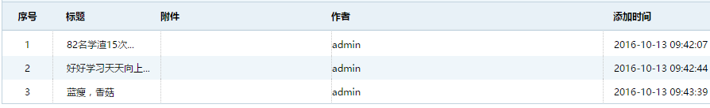
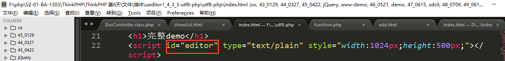
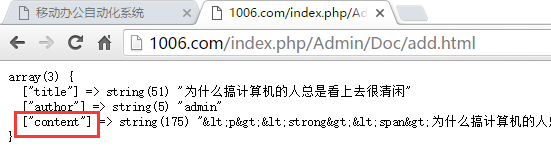
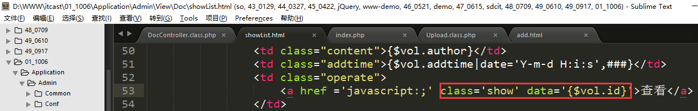

PHP高手之路之ThinkPHP（6）
==========================

一、综合案例-实现公文管理的相关功能
===================================

1、准备工作
-----------

### 1.1、创建数据表

表名：sp_doc

创建成功：

### 1.2、创建控制器

控制器：DocController.class.php

结构代码：

### 1.3、创建二级导航

修改模版文件Index/index.html，修改出公文管理的导航菜单：

修改二级导航的链接，列表方法还是使用showList，添加方法还是使用add。

2、实现公文的添加功能
---------------------

控制器：DocController.class.php【已存在】

方法：add（**二合一，将模版展示和保存处理写在一起**）

模版：add.html

**第一步：在控制器中创建add方法，展示模版文件**

**第二步：将模版文件add.html复制到指定的位置**

位置：./Application/Admin/View/Doc/add.html

位置中的Doc是不存在的，需要自行创建。

**第三步：检查表单**

Action：由于是提交给当前页面处理的，所以action可以不写

Ectype：声明当前表单中存在多媒体文件，只要是用了附件上传，则必须需要这个属性

文件上传域的type类型：

表单的提交，通过jQuery实现：

**第四步：不考虑文件上传，将其他的几个字段的数据，先实现入表保存**

保存结果：

3、实现公文的列表功能
---------------------

控制器：DocController.class.php

方法：showList

模版：showList.html

**第一步：编写showList方法，查询数据，传递数据，展示模版**

**第二步：将模版文件showList.html复制到指定的位置**

位置：./Application/Admin/View/Doc/showList.html

**第三步：将模版变量data，展示在模版中**

分析：由于data是select的返回结果，是一个二维数组，所以需要遍历操作进行展示

显示效果：

会发现，在标题一列，由于字数过多，导致多行显示的效果，影响美观，需要进行美化的处理：

**我们可以参考百度新闻的显示效果，对于多的字符进行截取，然后后面显示省略号**。

目前在提供的函数库文件中已经封装好了一个msubstr的函数，该函数可以进行中文截取：

**将function.php放到指定的位置（建议放到应用级别的目录中/Application/Common/common）**

参数说明：

**\$str：需要截取的字符串**

**\$start：表示开始位置**

**\$length：表示截取的长度**

**\$charset：表示字符串的字符集**

**\$suffix：表示是添加省略号**

显示效果：

说明：msubstr函数在function.php中已经定义，所以只需要将function.php移动到指定位置之后就可以在模版中使用。

二、ueditor
===========

1、介绍
-------

Ueditor是一款在线编辑器插件，在线编辑器又称为“富文本编辑器”。作用是为了方便图文混排操作，国外也有一款类似的插件，叫做CKeditor。

UE是百度公司开发的在线编辑器，官网：<http://ueditor.baidu.com/website/>

下载：

下载之后会得到一个zip格式的压缩包：

在压缩包中有一个index.html，它是demo文件：

通过demo文件中的代码，可以分析出，使用UE的步骤一共是有三步：

**第一步：引入外部的资源文件（javascript文件）。**

**Ueditor.config.js**

**Ueditor.all.min.js**

**Zh-cn.js**

**第二步：指定标签，设置容器的位置（编辑器显示的位置）。**

上述代码是通过id来指定容器的名字，后期实例化容器的时候需要指定的id。

**第三步：实例化容器，生成编辑器效果。**

2、使用UE编辑器替换掉公文管理中的原先效果
-----------------------------------------

**第一步：将utf8-php解压目录复制到公共静态资源文件目录下的插件目录（plugin），改名为ue**

**第二步：在目标模板文件add.html中引入三个需要的javascript文件**

**第三步：设置标签，定义富文本编辑器的位置**

将demo文件中的容器位置定义的代码复制替换掉textarea标签：

**第四步：实例化容器**

复制demo中的实例化代码：

显示效果：

显示效果存在2个问题：

第一个问题：将【内容：】覆盖了

第二个问题：宽高有点大

进行适当的调整容器：

调整后的结果：

**第五步：测试ue的提交结果**

通过上述的结果，我们可以发现2个问题：

**1、ue编辑器默认的name值是editorVlue，默认值和数据表中的字段名是不一样的，在后期添加的时候会被过滤，这个问题如何解决？**

解决办法：只需要给当前容器的标签指定一个name值就可以了。

**2、在UE的源码中的一些样式会被转化成实体字符，是谁去转化的实体字符呢？**

答：此处的转码，是由ThinkPHP的I方法进行转化的，使用的是htmlspecialchars。

关于使用UE的几个说明：

**1、防止sql注入和xss：光通过I方法解决不了，在后面我们会使用一个插件htmlpurifiy来对指定的标签进行过滤；**

**2、关于UE中的表情使用，这个功能需要联网；**

**3、关于图片上传，该功能需要配置，配置文件在ue/php/config.json，需要指定路径**

使用UE进行数据的增加结果：

在读取的时候需要将数据表中实体字符进行还原，可以使用函数**htmlspecialchars_decode**。

 三、ThinkPHP中的功能类-上传类
=================================

1、介绍
-------

上传文件的一个核心操作：移动临时文件（move_upload_file）。

在ThinkPHP中系统为了方便使用，封装了一个上传类：Upload.class.php。

方法：

构造方法：

可以在实例化的时候传递一个配置数组，由内部进行合并配置操作。

GetError方法：用户获取最后一次上传的错误信息

语法：**\$upload -\> getError();**

UploadOne方法：

参数是\$_FILES中的子元素。返回值是上传的结果。（**一种形式成功返回的时候具有九个元素一维数组，失败的时候返回false**）。

Upload方法：上传多个文件

参数通常是\$_FILES整个数组，返回值上传的结果，是二维数组，失败返回false。

2、完善公文添加中附件上传
-------------------------

**注意点：**

**第一：表单要有enctype属性**

**第二：表单中的文件域type类型必须是file**

**第三：表单提交方式必须是post**

**第一步：修改add方法中的表单数据处理部分**

为了符合MVC的设计规范，我们需要自定义一个模型，然后将文件上传以及数据的保存在模型中封装一个方法，由这个方法执行数据的保存。

创建模型文件：DocModel.class.php

编写方法，实现数据的保存。方法名叫做saveData：

**第二步：正式处理文件上传操作**

打印\$_FILES[‘file’]的结果：

**关于路径的说明：**

**如果地址是给服务器端脚本使用的，则可以使用相对于入口文件的相对路径，也可以使用带盘符的绝对路径。**

**如果地址是给客户端浏览器用的，则地址应该写成“/”形式，相对于站点域名后面。**

在上传的案例中整个路径都不会传递给客户端。，则属于上述的第一种情况。在上传的时候，保存路径建议写成带盘符的形式。

在开发的时候可以将带盘符的绝对路径进行拆分：

例如：D:\\WWW\\itcast\\01_1006\\Public\\Upload

可以拆分成：D:\\WWW\\itcast\\01_1006（工作目录） \\Public\\Upload（上传根目录）

而工作目录可以由魔术常量__DIR__表示，则上述的2个路径都可以用常量来表示。

常量可以在入口文件中定义：

打印上传结果：

特别注意：在保存上传文件的路径的时候，在数据表中千万不要写带盘符的路径，因为上传的文件一般都要被浏览器使用，如果使用了带盘符的路径，则会导致http协议和file协议冲突。

**说明：如果后期再写CURD操作的时候，只是简单的基本操作，则可以直接写在控制器中，如果数据需要处理，则最好是写在模型中进行数据的CURD操作。**

3、实现公文列表的附件下载
-------------------------

**第一步：展示文件的信息，修改模版文件showList**

在列表中可以展示出数据表中的filename（原始的文件名）

**第二步：在附件后面添加一个下载按钮，点击实现下载**

分析：如果有附件，则可以显示下载按钮，如果没有的话则不要显示。

**有没有附件可以取决于hasfile字段（0表示没有，1表示有），可以是if标签进行判断**：

**除了使用hasfile字段，我们还可以通过filepath、filename字段进行判断，如果不为空，则表示有附件：**

此时可以使用另外一个标签：empty或者notempty标签

所以上述的if标签代码，还可以写成：

编写下载方法download：

-   **\$file = "D:/Uploads/photo.jpg";**

-   **header("Content-type: application/octet-stream");**

-   **header('Content-Disposition: attachment; filename="' . basename(\$file) .
    '"');**

-   **header("Content-Length: ". filesize(\$file));**

-   **readfile(\$file);**

显示效果：

四、layer
=========

1、介绍
-------

Layer是一款基于jQuery开发的插件，作用是用于美化弹窗的效果。

官网：<http://layer.layui.com/>

在线手册：<http://www.layui.com/doc/modules/layer.html>

下载之后会得到一个压缩包：

经过精简之后只剩下一个javascript文件和一个css文件以及一张图片：

**使用步骤：**

**第一个：引入javascript文件（jQuery文件+layer.js，先引入jQuery文件）；**

**第二个：参考官网的demo来编写javascript代码就可以了。**

2、使用layer实现查看公文的功能
------------------------------

案例要求：点击公文后面的【查看】按钮，弹出窗口显示公文内容（content字段）。

**第一步：将layer目录（包含了layer.js和skin目录）复制到插件目录下**

**第二步：在页面中引入layer.js和jQuery的javascript文件**

测试layer使用：

测试代码：layer.alert(‘hello world.’);

**第三步：给【查看】按钮绑定点击事件**

传递公文的标题：

给查看按钮添加一个选择器，并且在点击显示内容的时候需要告知服务器我们需要查看的公文id，id我们可以通过自定义html属性的方式来传递，然后通过jQuery的attr方法获取属性的值（也就是id）：

demo代码：

1.  //iframe层

2.  layer.open({

3.  type: 2,

4.  title: 'layer mobile页',

5.  shadeClose: true,

6.  shade: 0.8,

7.  area: ['380px', '90%'],

8.  content: 'http://layer.layui.com/mobile/' //iframe的url

9.  });

目前的方法能够实现弹出效果，但是里面的内容不是我们想要的内容，所以此时需要编写方法展示公文的内容：

方法名：showContent

方法代码：

显示效果：

 五、扩展（2）
=================

在ThinkPHP中获取ip信息扩展
--------------------------

在ThinkPHP中系统封装了一个方法来获取ip：get_client_ip()【系统函数库文件中】

语法：

**Get_client_ip(可选参数数字)**

如果参数是0的话或者不写（默认），则表示返回正常的ipv4地址；

如果参数是1的话则表示返回ipv4地址对应的数字地址。

关于数字地址和ip地址的计算方法：

**重点是如何将ip地址转化成物理地址？**

什么是物理地址？

物理地址就类似于：

在ThinkPHP中系统提供了一个工具类，能实现转化，但是系统不提供转化所使用的数据，也就是说需要自己去寻找对应的数据库。

数据库可以从纯真官网去寻找（<http://www.cz88.net>）

下载安装的程序之后在其安装目录中可以找到qqwry.dat文件：

该文件就是后续所使用到的数据库文件。

ThinkPHP中提供的类：Iplocation.class.php

构造方法：

可以得知，在实例化的时候可以传递一个文件名，文件名所在的位置和当前的类是同级目录。

Getlocation方法：查询，需要传递ip地址，如果为空则表示查询当前用户的ip地址

将数据库文件复制到指定的目录

编写代码：

接口写法：

