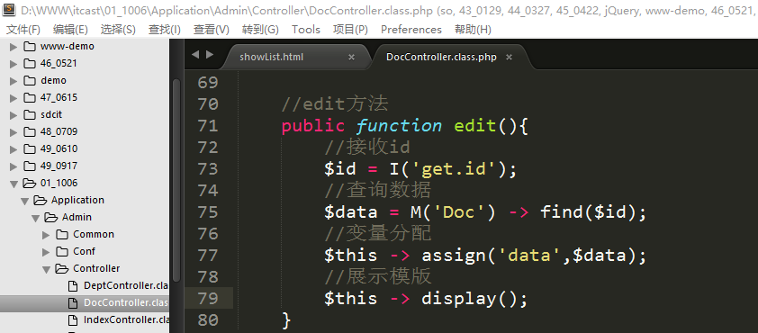
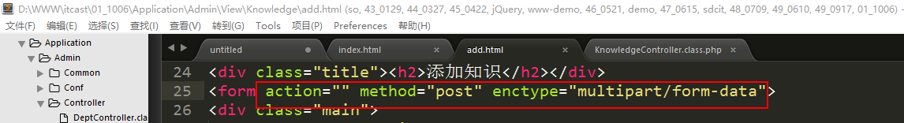
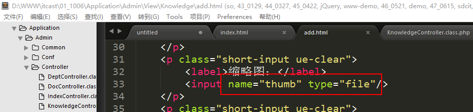
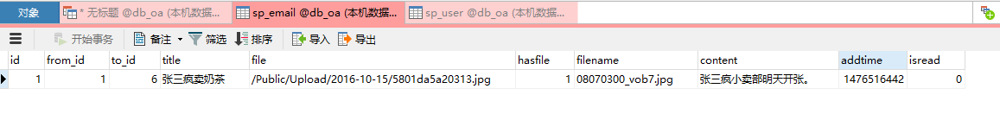
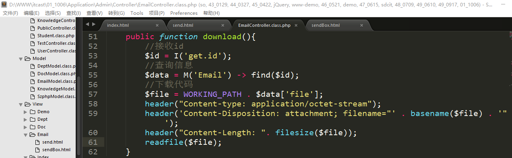

PHP高手之路之ThinkPHP（7）
==========================

一、综合案例-完善公文管理
=========================

1、实现公文的编辑
-----------------

控制器：DocController.class.php【已存在】

方法：edit（将展示模版和数据的保存写在一起）

模版：edit.html

**第一步：修改模版文件showList.html，在每行后面添加一个【编辑】按钮，点击之后跳转到编辑页面（edit方法）**

显示效果：

**第二步：在控制器中编写方法edit，展示数据和模版**

**第三步：将模版文件edit.html放到指定的位置**

位置：./Application/Admin/View/Doc/edit.html

说明：此处的模版文件可以直接复制add.html来使用，并且改名为edit.html

**第四步：在edit.html模版中展示当前修改记录的原始数据**

说明：

**1、关于文件域的值：在文件域中输出value属性没有意义，所以我们可以采用和修改密码一样的原理，如果用户选择了文件，则表示修改，如果没有选择，则表示不修改文件；**

**2、由于content字段，在之前写入数据表的时候接收通过I方法进行了转码处理，所以在展示的时候还需要解码，还原之前的形式，需要使用到htmlspecialchars_decode。**

**第五步：检查表单**

**在表单中添加一个隐藏域（通过隐藏的表单项来传递一个值），值可以是\$data.id，也可以写成{\$Think.get.id}。**

**第六步：改写edit方法，判断请求类型，实现数据的保存**

实现数据的保存提交：

模型中的自定义保存数据方法updateData：

二、综合案例-实现知识管理
=========================

1、准备工作
-----------

### 1.1、数据表

数据表名：sp_knowledge

创建结果：

### 1.2、导航菜单

修改模版文件Index/index.html文件，创建导航菜单：

### 1.3、创建控制器

**控制器文件名：KnowledgeController.class.php**

2、实现知识的添加功能
---------------------

控制器：KnowledgeController.class.php【已存在】

方法：add（二合一）

模版：add.html

**第一步：创建方法add，展示模版文件add.html**

**第二步：将模版文件add.html复制到指定的位置**

位置：./Application/Admin/View/Knowledge/add.html

**第三步：检查表单**

注意：

1、如果有文件上传则需要有enctype属性；

2、要求文件域是file类型；

3、请求类型是post；

**第四步：改写add方法，处理表单的提交数据的保存**

**第五步：编写自定义模型的代码**

创建自定义模型：KnowledgeModel.class.php

实现代码，编写方法：

Public function addData();

缩略图的制作：

需要使用到功能类：Image.class.php（图像处理类）。

**注意：如果使用图形处理类，则必须开启GD2扩展库**。

方法：

构造方法：__construct

其中形参都是可选的，所以在实例化的时候可以不传递任何的参数。

Open方法：打开图片，一般情况下，参数是图片的路径（建议使用绝对路径）

Thumb方法：参数一般只传递前2个即可（宽高）**等比缩放的原则。举个栗子，如果之前的图片宽高是2000:1000，即使我们设置缩略图的比例是100:100，则生成的结果还是100:50**。

Save方法：保存图片，只需要传递第一个参数图片保存完整路径即可

根据上述的方法，如果不考虑实例化图形类则我们可以归纳出制作缩略图的步骤大致为：

**第一步：打开图片；**

**第二步：制作缩略图；**

**第三步：保存图片；**

具体可以参考手册中的demo代码：

特别说明：**因为在图形处理类中所有的执行方法返回值都是\$this说明2点，第一个点就是可以使用连贯操作的形式，第二个点就是没有办法判断图形处理是否成功**。

保存测试数据：

实现上传代码：

制作缩略图：

数据表中的数据：

3、实现知识的列表功能
---------------------

控制器：KnowledgeController.class.php

方法：showList

模版：showList.html

**第一步：创建方法showList，获取数据，展示数据和模版**

**第二步：将模版文件showList.html复制到指定的位置**

位置：./Application/Admin/View/Knowledge/showList.html

**第三步：在模版中遍历数据data，在模版中展示**

显示效果：

**第四步：实现图片的下载**

可以通过empty标签来判断是否有图片：

显示效果：

编写download方法实现下载：

三、综合案例-实现邮件管理
=========================

邮件：这里指的邮件不是一般所说的email邮件（邮件地址带有\@符号的），指的是一般论坛网站的站内消息（私信，pm---private
message）。站内信一共可以分为以下几个组成部分：**邮件发送、邮件收件箱、邮件发件箱**。

1、准备工作
-----------

### 1.1、数据表

数据表：sp_email

创建成功：

### 1.2、导航菜单

修改文件Index/index.html，将邮件管理的菜单显示出来：

### 1.3、创建控制器

**控制器文件名：EmailController.class.php**

2、实现邮件的发送功能
---------------------

控制器：EmailController.class.php【已存在】

方法：send（二合一，展示模版+数据保存）

模版：send.html

**第一步：创建send方法，先展示邮件发送功能的模版页面**

**第二步：将模版文件send.html复制到指定的位置**

位置：./Application/Admin/View/Email/send.html

在模版中要求选择收件人，所以需要去改写send方法去展示收件人获取收件人的信息：

**第三步：改写send方法，查询收件人的信息，展示在模版中**

**第四步：在模版中展示收件人列表**

**第五步：检查表单**

Form标签：

文件域：

**第六步：将数据在提交之后保存到数据表中**

先判断请求类型，如果是post请求，则处理数据；如果是其他则展示数据和模版：

创建自定义模型：

编写需要的addData方法实现数据处理和保存入库（文件处理+数据处理）：

此时，功能代码已经全部的编写结束，测试邮件发送功能，在数据表中发送结果如下：

如果数据表中有刚才提交的数据，则表示邮件发送成功。

3、实现邮件的发件箱功能
-----------------------

控制器：EmailController.class.php

方法：sendBox

模版：sendBox.html

**第一步：创建方法sendBox，获取列表数据，展示数据和模版**

**注意：当前功能是发件箱，在发件箱中需要显示出收件人的名字。（此时数据表中存储的是收件人id，to_id因此，需要联表查询数据）。**

**主表：sp_email t1**

**从表：sp_user t2**

**关联条件：t1.to_id = t2.id**

原生的sql语句：**select t1.\*,t2.truename as truename from sp_email as t1 left
join sp_user as t2 on t1.to_id = t2.id where t1.from_id = 当前用户的id;**

将上述的sql代码复制到navicat中去执行：

将上述代码在ThinkPHP中去执行：

**第二步：在模版中展示数据**

将模版文件sendBox.html复制到指定的位置

位置：./Application/Admin/View/Email/sendBox.html

显示效果：

**第三步：实现附件的下载**

如果有附件，则显示附件的下载，没有则不显示下载按钮

显示效果：

在控制器中编写download方法：

四、扩展（3）
=============

1、空操作
---------

空操作是指系统在找不到指定的操作方法的时候，会定位到空操作方法来执行（针对控制器也是如此），利用这个机制，我们可以**实现错误页面**和一些URL的优化。

**关于空操作的说明：**

**1、空操作方法：在控制器中可以定义一个操作方法名字叫做_empty()；**

**2、空操作控制器：在ThinkPHP中存在一个空的控制器，当指定的控制器找不到，则会去访问空的控制器，空控制器的文件名叫做EmptyController.class.php。**

空操作方法实现：

例如，下面的空操作方法，我们写在Email控制器中，则如果访问email控制器中的方法不存在，则会默认访问_empty方法。

空的控制器实现：

创建空的控制器：EmptyController.class.php

上述的代码会在访问的控制器不存在的时候进行调用。

案例：使用空操作方法实现404页面的自定义。

模版文件：

**第一步：将模版文件复制到指定的位置**

同时将静态文件放到指定的目录中：

修改模版中的原图片引入路径：

**第二步：在空操作控制器中的空操作方法展示错误的模版页面**

显示效果：

当控制器存在，方法不存在的时候：

当控制器不存在的时候：

 五、jQuery中的ajax回顾
==========================

在jQuery中ajax方法一共有几个？

有4个：**get、post、ajax**、getJson（解决跨域的时候使用）

1、\$.get方法
-------------

-   jQuery.get(url,[callback],[type])或者 \$.get(url,[callback], [type])

在jQuery中\$表示jQuery。

参数说明：

url：必须的参数，表示请求的url地址；

callback：可选参数，表示请求成功之后触发的回调函数；

type：可选参数，期望的返回数据类型，常见的类型有：**json**、xml、text、html；

2、\$.post方法
--------------

-   jQuery.post(url,[data],[callback], [type])
    或者\$.post(url,[data],[callback], [type])

参数：

url：必须，请求地址；

data：可选，给url传递的post参数；

callback：可选，执行成功之后的回调函数；

type：可选，期望的返回数据类型；

3、\$.ajax方法
--------------

Ajax方法是jQuery中ajax方法（get和post）的底层实现方法：

语法：

\$.ajax(json对象)，参数只有一个，那就是json对象

Json对象中的属性：

•async 是否是异步，默认是；

•cache 是否使用缓存，默认是，当dataType为jsonp或者script的时候默认是否

•complete 当请求执行完成的时候触发的回调函数，完成不一定表示成功。

•data 表示传递的参数，是一个json格式

•dataType 期望的返回数据类型，有json、xml、text、html等等

•success 表示请求成功之后触发的回调函数

•type 表示请求的类型，如get、post

•url 请求的地址
