PHP高手之路之ThinkPHP（8）
==========================

一、完善登录控制
================

1、翻墙
-------

这里所指的翻墙不是指绕过GFW（国家防火墙）看国外一些被限制的网站，而是指一些用户会使用绕过系统登录页面的这个方式（如：直接在地址栏中输入后台的地址）来绕过系统登录页面，这样方式叫做翻墙。

这种情况一般情况下都是不被允许的。之所以能够直接输入地址能够看到不该当前用户看到的内容，主要是我们在OA系统中还没有做登录的判断功能。‘’

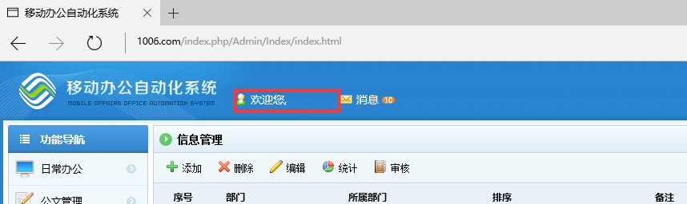

解决方法：

分析：既然说缺少登录判断的功能代码，那么就可以在固定的地方来添加判断的代码。

方法1：可以在每个需要的控制器中添加判断代码，可以添加在每个控制器中构造方法中；

方法2：方法1中的方法虽然是可行的，但是代码的重复性太高；那我们可以把这段固定的判断代码写在父类控制器中。

在当前OA系统中目前各个控制器所使用的继承关系：

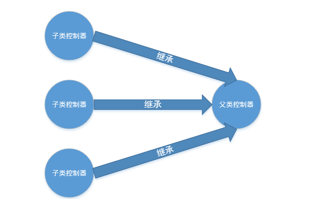

上述的继承方法是所有的控制器都是直接去继承父类控制器，但是由于Controller.class.php文件是ThinkPHP系统的文件，不建议修改。而php又不允许多继承，那如何去解决这个问题？

答：既然不允许多继承，那么可以使用继承链（多级继承）方法去实现。

在使用多级继承的时候，可以将一个系统中的全部控制器划分成2部分：**公共控制器（就是不需要登录就可以访问的控制器，如Public控制器）、需要验证的控制器（其中的内容需要登录之后才能查看）。**

多级继承的实现方法：

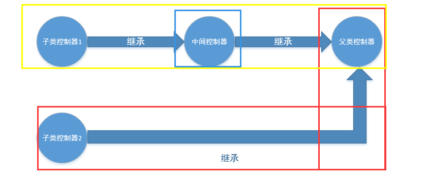

上面的图中，**需要验证登录的控制器，继承了中间控制器（自己创建的），在中间控制器中的构造方法中进行用户的权限判断，好处是可以只写一次登录判断；公共控制器，可以直接去继承ThinkPHP系统的父类控制器，该继承链不需要判断用户是否登录**。

2、实现OA系统的防止翻墙
-----------------------

**第一步：创建中间控制器**

命名说明：除了不能使用Empty名字之外，其他没有什么要求。但是一般情况下名字也是存在一个约定俗成名字：Common，全文件的名称应该是**CommonController.class.php**。

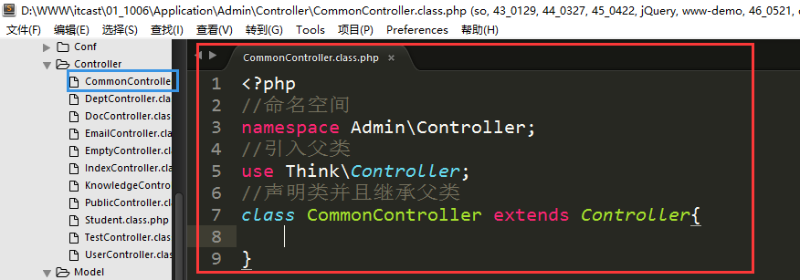

**第二步：修改需要验证的控制器的继承类**

需要验证的控制器都应该去继承中间控制器CommonController

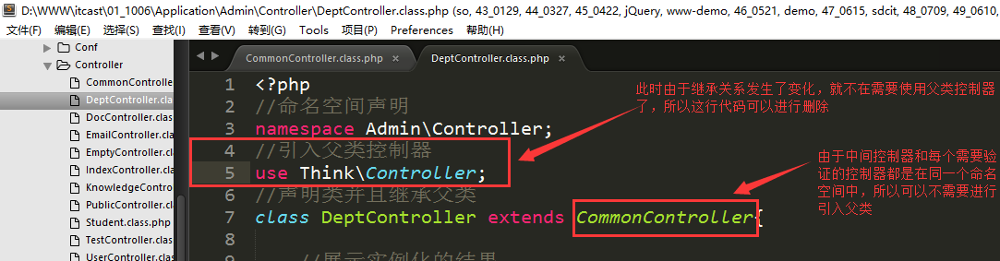

下面的这些控制器需要继承中间控制器：

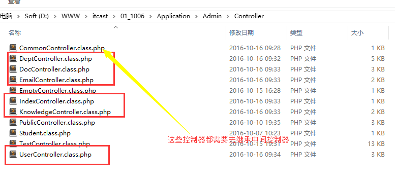

在继承关系处理完毕之后，按照方法2中的描述，则应该在中间控制器中编写方法：**构造方法，在构造方法中进行判断用户是否登录**

在ThinkPHP中系统支持2个构造方法写法：

**\__construct()：php内置的构造方法，在ThinkPHP，如果使用该方法，则需要先构造父类。**

**\_initialize()：该方法有ThinkPHP提供，不需要构造父类。**

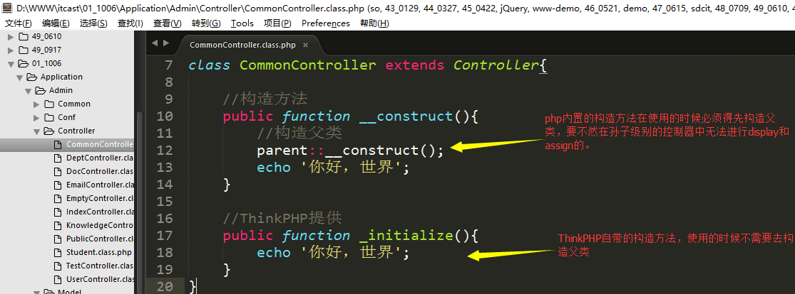

在编写判断代码的时候有一个误区：

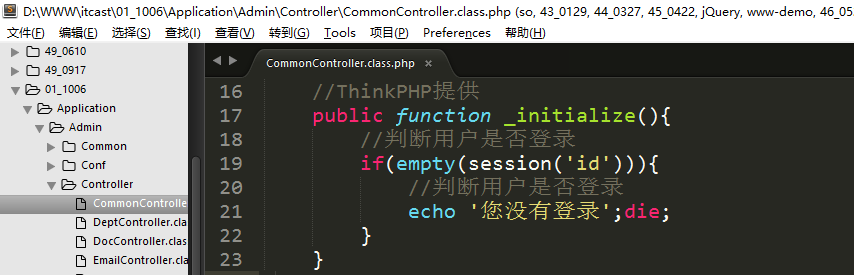

上述代码，第一眼看下来感觉语法是没有问题的，但是在执行的时候会报错：

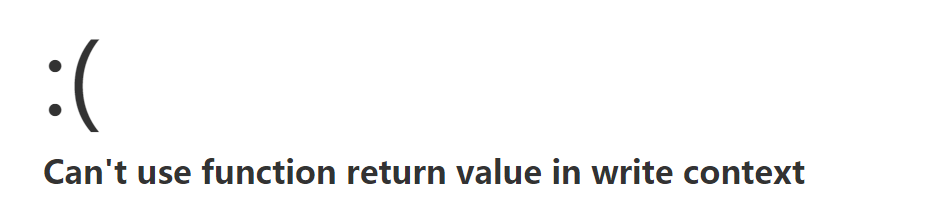

错误内容为，**在empty方法中不能使用函数的返回值作为参数**。

判断用户是否登录：

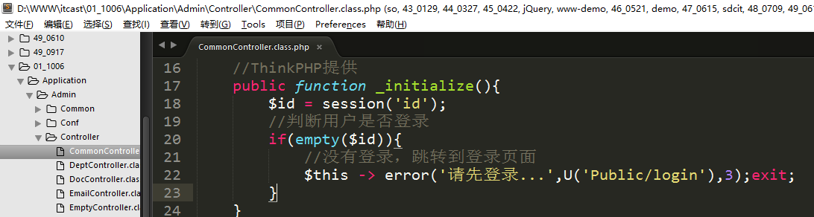

但是在实际开发的时候，一般会造成类似这样的效果：

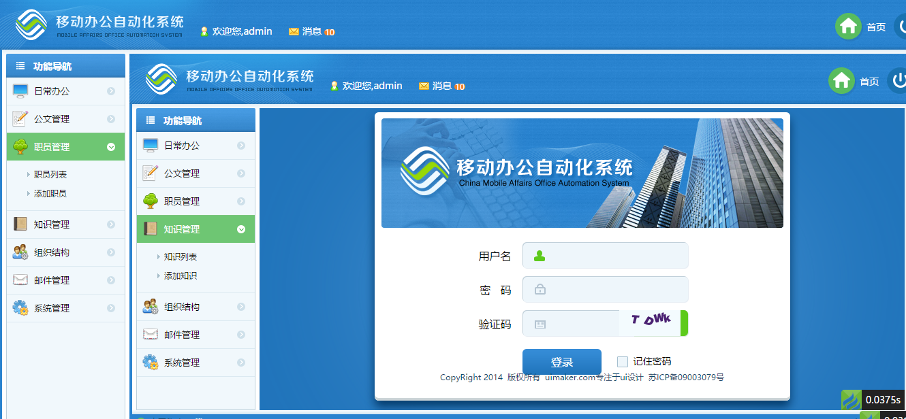

上述之所以会成这样，是由于每次跳转都是当前页面，也就是当前的iframe。

解决办法：**让最顶级的页面进行跳转。**

可以通过javascript代码实现最顶级的页面跳转。

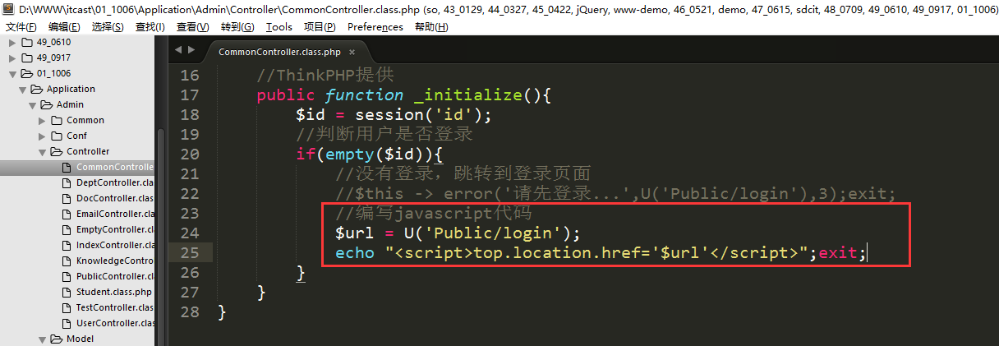

之所以javascript代码可以在浏览器中执行，是因为输出的javascript代码段其实就是字符串，字符串在输出到浏览器段会解析成javascript代码，进而被浏览器所执行。

二、综合案例-完善站内信功能
===========================

1、实现邮件管理的收件箱功能
---------------------------

控制器：EmailController.class.php【已存在】

方法：recBox

模版：recBox.html

**第一步：在控制器中创建方法，名字叫做recBox，作用是读取数据展示模版**

针对收件箱，应该是显示发件人（from_id），需要去关联用户表（sp_user）：

**主表：sp_email t1**

**从表：sp_user t2**

**关联条件：t1.from_id = t2.id**

原生的sql语句：**select t1.\*,t2.truename as truename from sp_email as t1 left
join sp_user as t2 on t1.from_id = t2.id where t1.to_id = 当前用户的id;**

将上述的sql在navicat中执行：

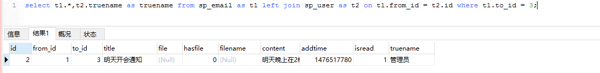

在ThinkPHP中的实现：

在此处进行调试的时候为了防止session在后期登录的时候被覆盖，可以使用两种方式进行调试：

1、新打开一个浏览器。

2、使用浏览器的隐身模式（该模式下不会记录历史记录）。

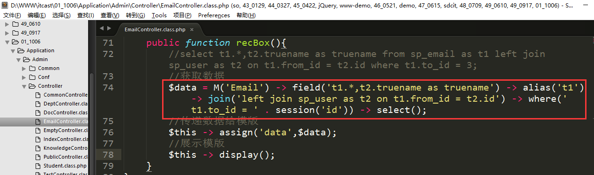

**第二步：展示模版页面，将模版文件recBox.html复制到指定的位置**

位置：./Application/Admin/View/Email/recBox.html

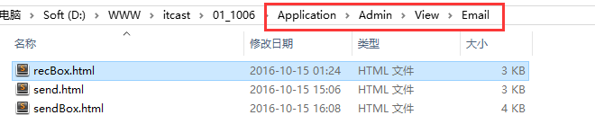

**第三步：在模版中展示数据**

分析：由于模版变量data是select的返回值，在输出的时候需要进行遍历

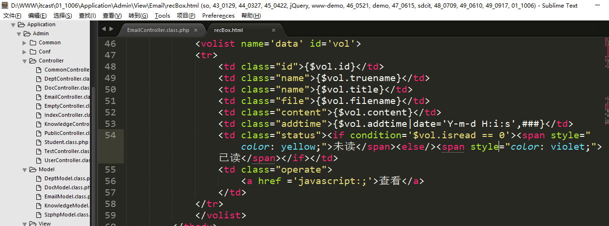

显示结果：

**第四步：使用layer来查看邮件的内容**

Layer使用步骤：

第一步：引入javascript文件；

第二步：直接编写代码；

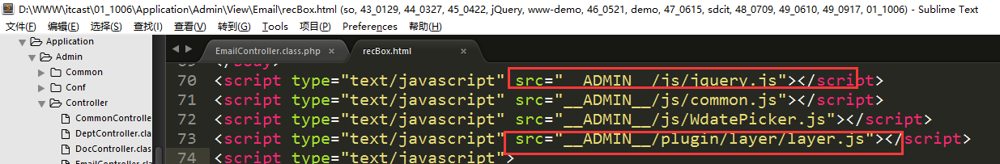

给查看按钮绑定点击事件，点击之后弹出窗口：

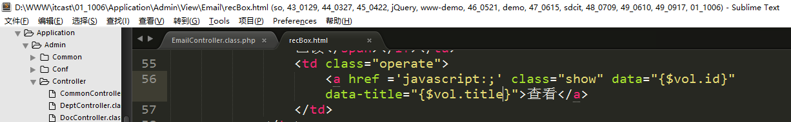

编写jQuery代码：

1.  layer.open({

2.  type: 2,

3.  title: '很多时候，我们想最大化看，比如像这个页面。',

4.  shadeClose: true,

5.  shade: false,

6.  maxmin: true, //开启最大化最小化按钮

7.  area: ['893px', '600px'],

8.  content: 'http://fly.layui.com/'

9.  });

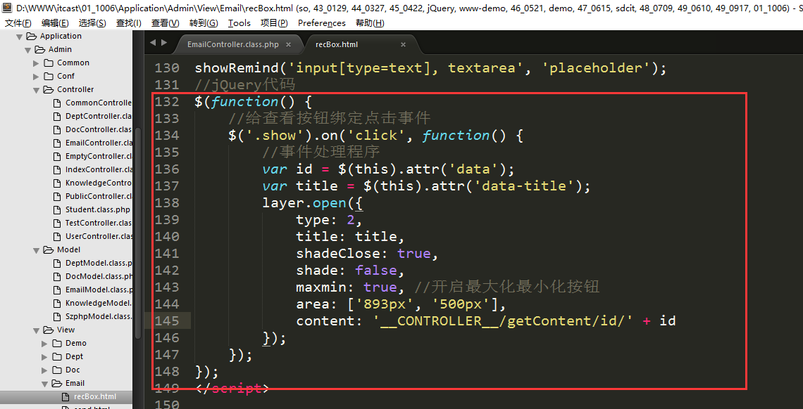

**第五步：编写getContent方法展示内容**

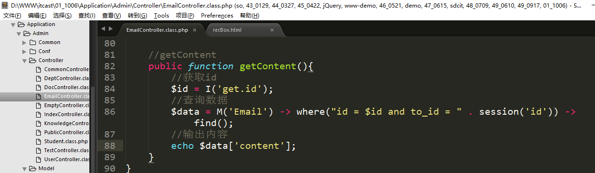

在查询的时候，为了避免用户获取到请求内容的方法，进而在后面随意更改id来获取别人的邮件，则可以在查询的时候加上一个条件限制，限制只能查询自己的邮件。

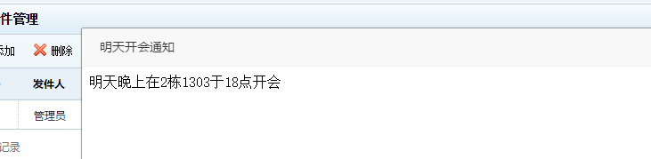

**第六步：附件下载完善**

有附件的话，显示下载按钮：

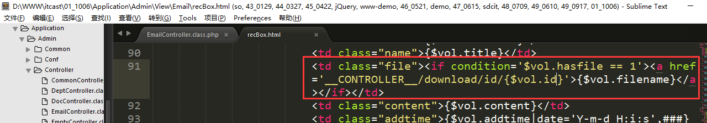

2、实现邮件读取状态的改变
-------------------------

**第一步：修改getContent方法，在读取出内容的时候修改邮件的读取状态**

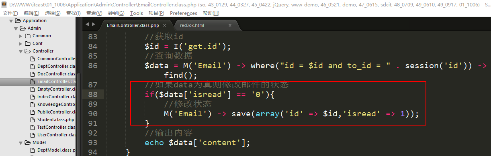

虽然说目前能实现数据表中的数据变化，但是不能实现页面显示效果的变化。

**第二步：修改模版，让页面刷新**

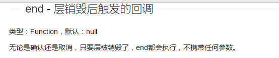

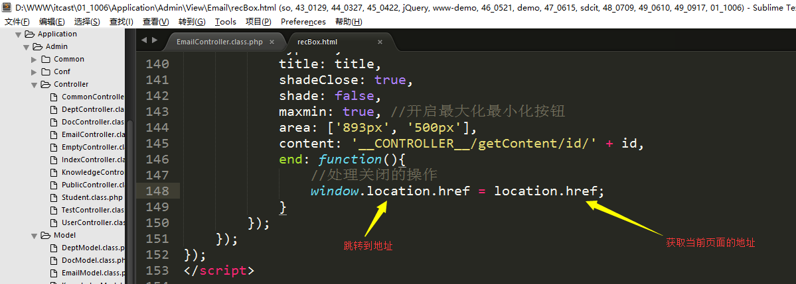

虽然现在已经能够实现查看之后刷新状态，但是当前的是无论是什么情况都刷新，有的时候没有必要全去刷新，只有当是未读的时候才去刷新。

通过行内自定义属性的方式传递参数isread：

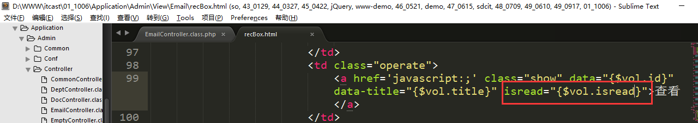

判断代码：

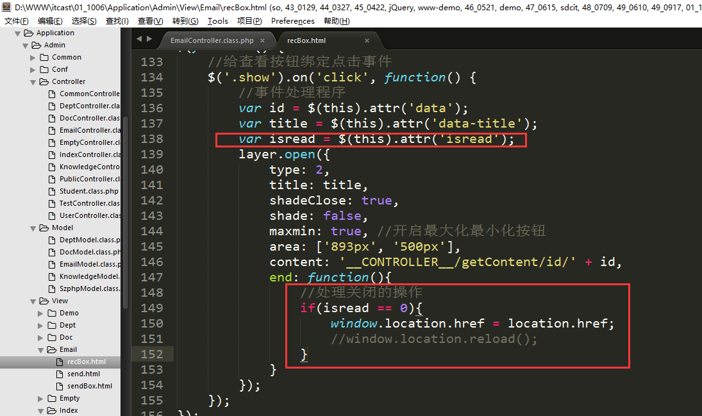

3、实现邮件的实时提醒功能
-------------------------

此处需要使用ajax、定时器（反复性定时器、一次性定时器）。

原理：**就是在页面加载完成之后，通过定时器，不断的去发送ajax请求，来获取当前用户未读信息的数量，拿到数量之后在模版中进行展示**。

**第一步：编写页面Index/index.html的载入事件**

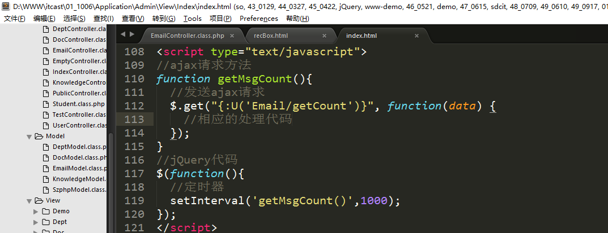

**第二步：在Email控制器中编写getCount方法，输出当前用户未读邮件的数量**

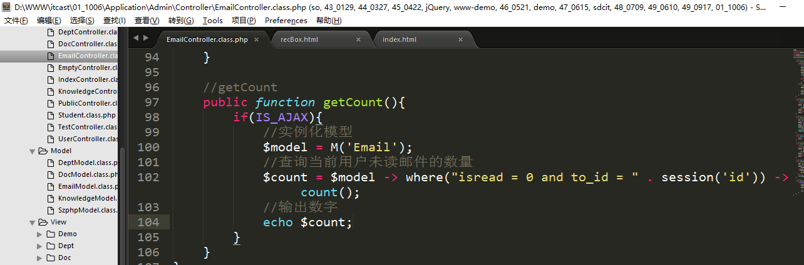

**第三步：在模版中修改后期操作（将获取到的未读邮件数量，在页面顶部显示）**。

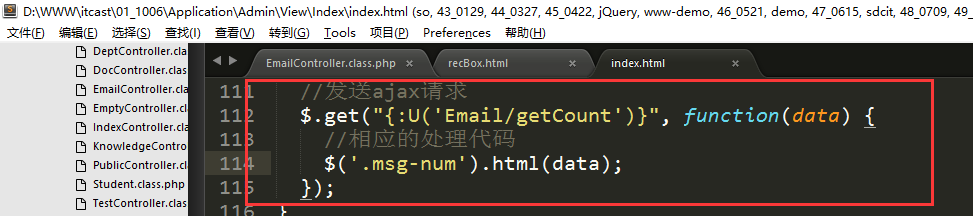

**第四步：点击消息按钮，让其跳转到收件箱**

注意：在写的时候要求是在iframe中打开新页面

**如果需要在iframe中打开，则target的属性值必须是目标iframe的name值**。

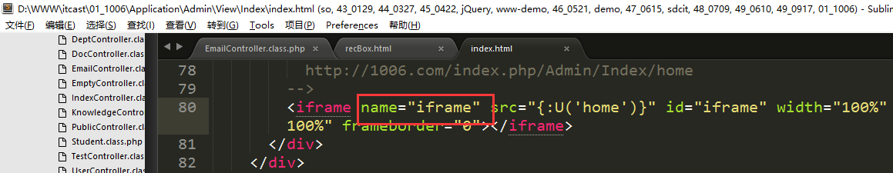

给iframe设置name值

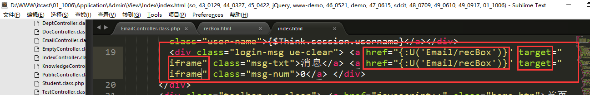

三、RBAC
========

RBAC全称叫做基于用户组/角色的权限控制（Role-Based Access Control）。

在目前来说，一般的项目有以下两种权限管理方式：RBAC方式、传统方式。

1、传统权限分配方式
-------------------

传统的权限分配方式有一个最大特征：**将权限和用户挂钩**。典型的有ecshop的管理后台：

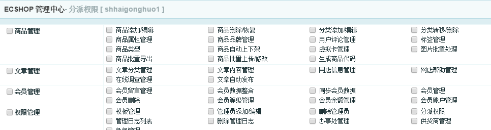

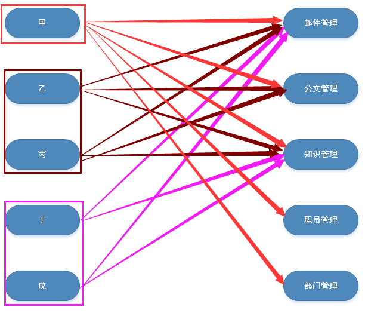

根据上述的连线，可以发现该种权限分配方式存在以下几点不足：

1、在效率上不高；

2、在设置权限的时候没有统一的标准；

所以上述的权限分配方式，在一般大型网站项目中不会去使用。

2、RBAC权限管理方式
-------------------

RBAC在使用的时候有两种体现方式：**基于表结构的RBAC权限管理、基于文件结构的RBAC权限管理**。

两者的差异就在于数据的存储位置，前者是存储在数据表中（3表、5表），后者是将数据存储在文件中。不管是前者还是后者原理都是一样的。

基于数据表的形式：优点是在后期数据维护上方便，有界面来操作数据表，但是不易于理解。

**基于文件结构的形式：优点在于简单容易理解，但是缺点是不易于维护，没有维护界面**。

**RBAC原理**：

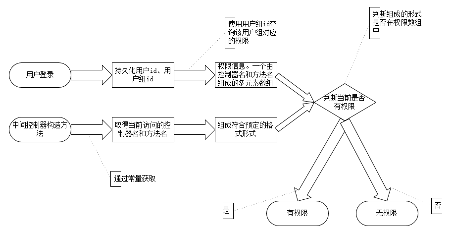

**在用户登录的时候，会持久化用户登录信息（如角色id），然后根据橘角色id去查询该角色有什么权限；然后在中间空间控制器中去获取当前用户访问的控制器名和方法名，组成与预定义的格式一致的形式，来判断组成后的形式在不在权限信息当中，如果在，则表示有权限，如果不在则表示没有权限**。

RBAC权限方式：最大特点就是将权限跟用户组/角色挂钩，然后再将用户和用户组进行挂钩。

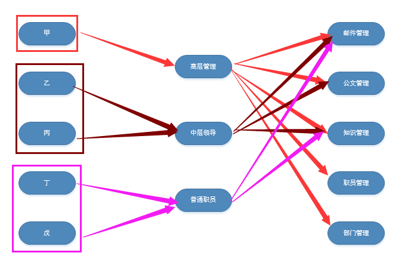

从上述的图中可以发现，RBAC模式，存在以下几个优点：

1、在项目开发的初期，权限的标准就已经可以做到统一。

2、在维护层面上来看，该种分配方式也要比传统的权限分配方式要简单。

所以在一般大型网站项目中RBAC模式使用几率要比前面的传统权限分配方式要多。

3、针对OA系统实现RBAC权限管理
-----------------------------

**第一步：先定义用户组的权限信息数据**

当前方式是基于文件的形式，则数据需要写在文件中。

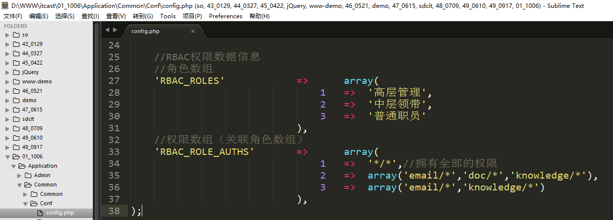

**第二步：在指定的地方去根据当前用户的role_id获取当前用户应该有的权限。**

编写位置：中间控制器的构造方法

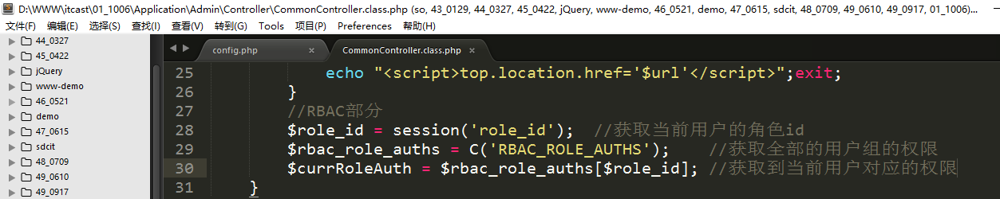

**第三步：通过常量的方式来获取当前用户访问的路由中控制器名和方法名**

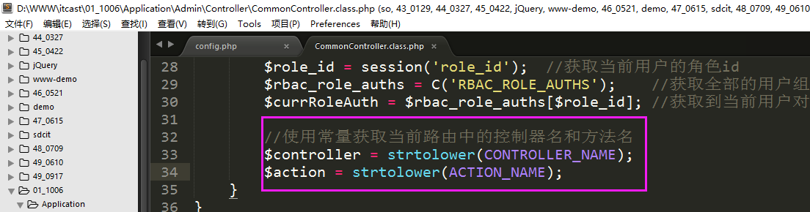

**第四步：判断组成的权限形式是否在权限数组当中**

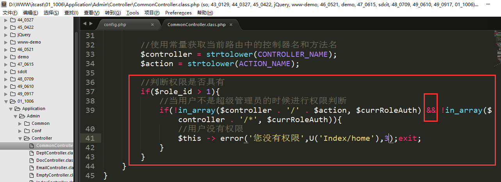
